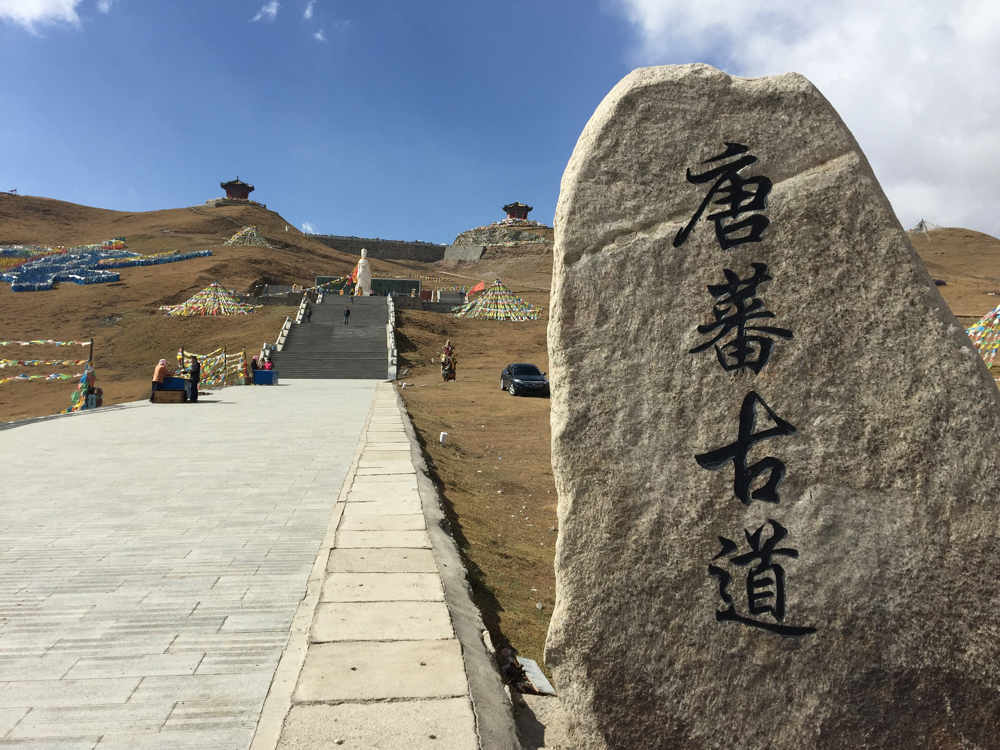
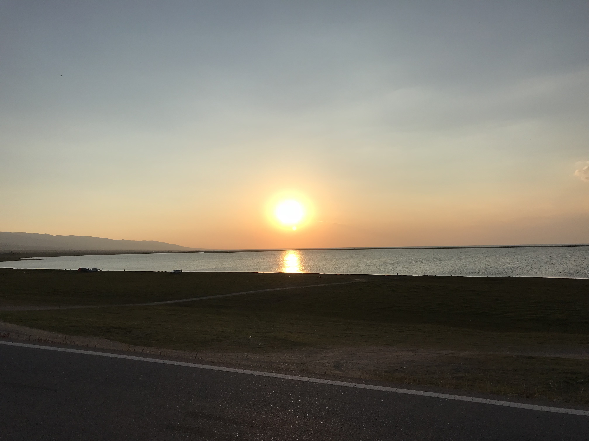
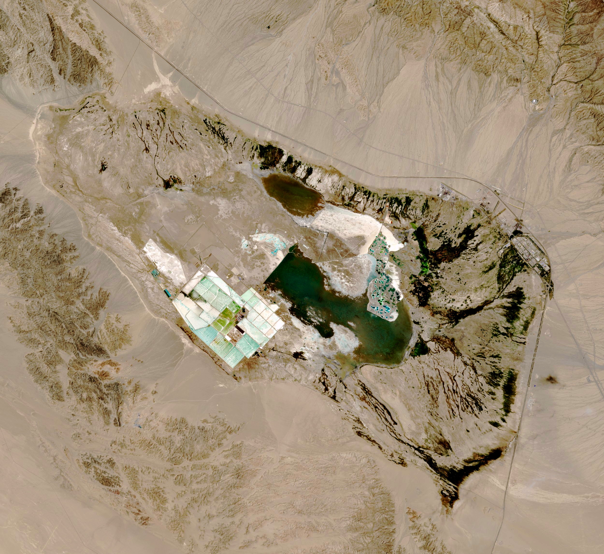
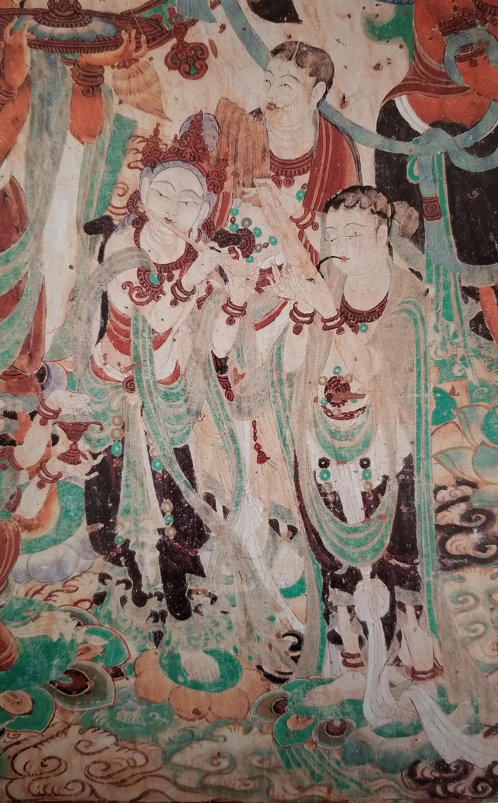
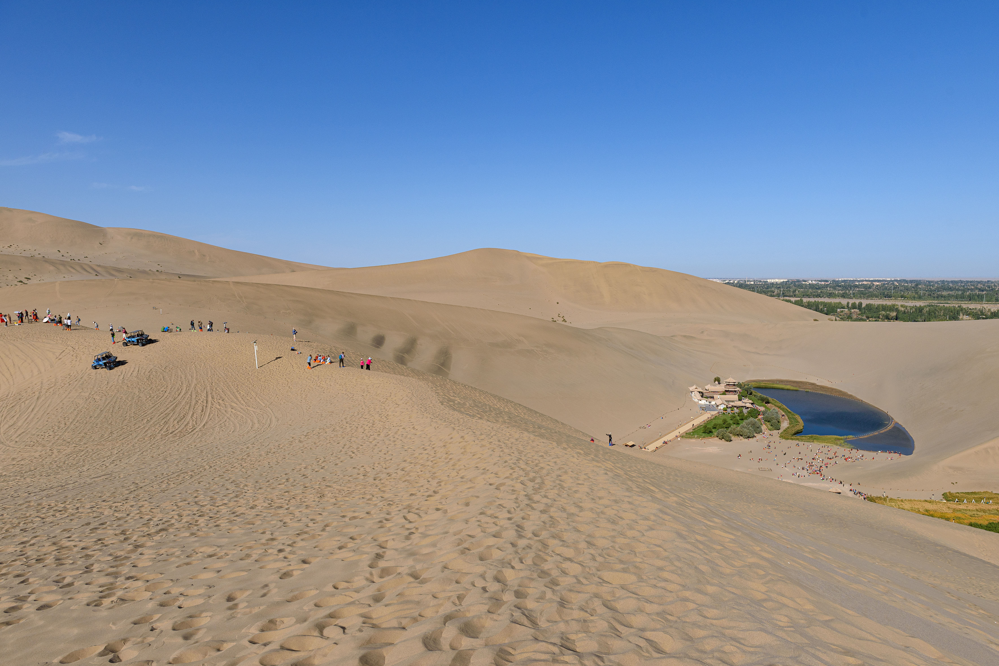
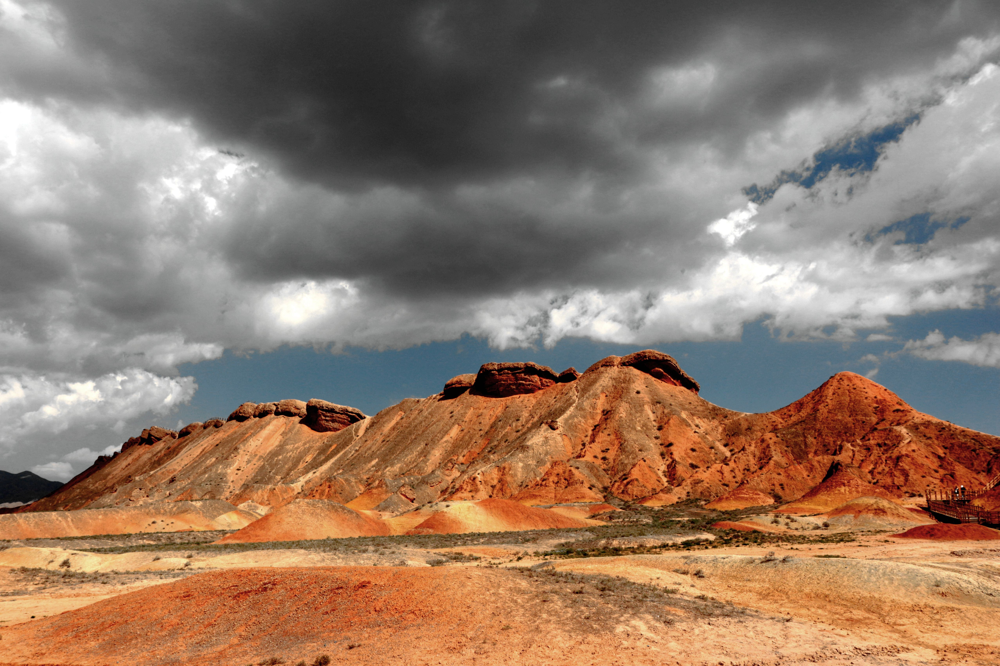
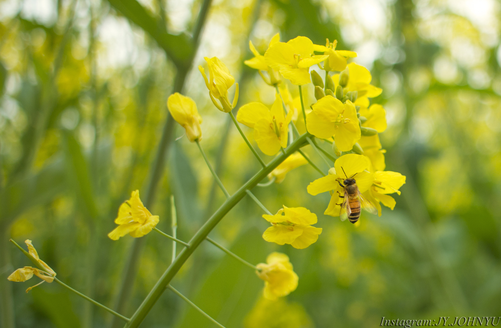

# 大西北 Road Trip · July 18–24, 2026

**Group:** 7 people (5 Italians, 2 Chinese) · 1 car (7-seater) · Budget–midrange
**Loop:** Xining → Qinghai Lake → Chaka → Feicui Hu → Dunhuang → Jiayuguan → Danxia → Qilian → Xining

> **Before you go:** [[places/packing-list|Packing List]] · [[places/useful-phrases|Useful Chinese Phrases]]

---

## Trip Overview

| Day       | Date   | Route                | Drive        | Key Stops                          | Sleep     | Temp    |
| --------- | ------ | -------------------- | ------------ | ---------------------------------- | --------- | ------- |
| 1         | Jul 18 | Xining → Chaka       | 300km · 4h   | Riyueshan, Qinghai Lake, Chaka     | Chaka     | 15–20°C |
| 2         | Jul 19 | Chaka → Dachaidan    | 330km · 4h   | Chaka sunrise, Delingha, Feicui Hu | Dachaidan | 20–28°C |
| 3         | Jul 20 | Dachaidan → Dunhuang | 500km · 6h   | Qaidam Basin drive                 | Dunhuang  | 38–42°C |
| 4         | Jul 21 | Dunhuang             | —            | Mogao Caves, Mingsha Dunes         | Dunhuang  | 38–42°C |
| 5         | Jul 22 | Dunhuang → Jiayuguan | 400km · 4.5h | Jiayuguan Fort + Overhanging Wall  | Jiayuguan | 30–35°C |
| 6         | Jul 23 | Jiayuguan → Qilian   | 460km · 6h   | Qicai Danxia, Menyuan flowers      | Qilian    | 20–25°C |
| 7         | Jul 24 | Qilian → Xining      | 220km · 3h   | Horseback riding                   | —         | 20–25°C |
| **Total** |        |                      | **~2,210km** |                                    |           |         |

---

## Day 1 — July 18 · Xining → Qinghai Lake → Chaka
*300km · 4h driving · Sleep: Chaka · 15–20°C*

- **2:00pm** Pick up car, depart Xining
- **3:30pm** [[places/riyueshan|Riyueshan Pass]] (3,520m) — 20-min stop, photo, move on
- **4:15pm** [[places/qinghai-lake|Qinghai Lake]] north shore (Erlangjian) — 1.5hrs, walk the shore
- **6:00pm** Drive to Chaka (~170km, 2hrs)
- **8:00pm** Arrive Chaka, dinner, overnight

> **Tonight:** Set alarm for 6am. Chaka mirror reflection only works at sunrise when the wind is still.

| | |
|--|--|
|  |  |

---

## Day 2 — July 19 · Chaka → Delingha → Feicui Hu
*330km · 4h driving · Sleep: Dachaidan · 20–28°C*

- **6:00am** [[places/chaka-salt-lake|Chaka Salt Lake]] at sunrise — the mirror reflection. 1.5hrs
- **8:00am** Breakfast, pack up
- **8:30am** Drive to Delingha (~230km, 2.5hrs)
- **11:00am** Delingha — lunch, 30min walk at [[places/delingha|Haizi Poetry Park]]
- **1:00pm** Drive to Feicui Hu / Dachaidan (~100km, 1hr)
- **2:00pm** [[places/feicui-hu|Feicui Hu]] colored lakes — 2hrs wandering
- **4:30pm** Check in Dachaidan, rest, early dinner

> **Tonight:** Driver fills tank completely before sleeping — the Qaidam Basin to Dunhuang has sparse fuel stations.

| | |
|--|--|
|  |  |
|  | |

---

## Day 3 — July 20 · Dachaidan → Dunhuang · The Desert Highway
*500km · 6h driving · Sleep: Dunhuang · 38–42°C*

- **8:00am** Depart Dachaidan, full tank
- **8:00am–2:00pm** Qaidam Basin highway — one of the great desert drives in China. Flat salt pans stretching to the horizon, distant mountain ranges floating above the heat shimmer, almost no traffic. Stop anywhere for photos — the emptiness is the point.
- **2:30pm** Arrive Dunhuang, check in (2 nights), rest — it's 40°C outside
- **7:00pm** [[places/dunhuang-night-market|沙州夜市 (Shazhou Night Market)]] — first real taste of Silk Road street food. Allow 1.5hrs.

> **Tonight:** Confirm Mogao Caves booking for tomorrow morning. Tickets at mgk.com.cn.

---

## Day 4 — July 21 · Dunhuang Full Day
*Sleep: Dunhuang · 38–42°C*

- **8:00am** [[places/mogao-caves|Mogao Caves]] — pre-booked morning slot, guided tour ~3hrs. Finish by 11am.
- **12:00pm** Lunch, long rest indoors — do not be outside between noon and 5pm
- **5:30pm** [[places/mingsha-dunes|Crescent Moon Spring]] (月牙泉) — walk to the spring first while light is still high
- **6:30pm** Mingsha Sand Dunes — camel ride at golden hour (~¥150/person), watch sunset from the ridge
- **8:30pm** Dinner, night market

| | |
|--|--|
|  |  |

---

## Day 5 — July 22 · Dunhuang → Jiayuguan
*400km · 4.5h driving · Sleep: Jiayuguan · 30–35°C*

- **8:00am** Depart Dunhuang
- **12:30pm** Arrive Jiayuguan, lunch
- **2:00pm** [[places/jiayuguan-fort|Jiayuguan Fort]] — western end of the Great Wall, "Greatest Pass Under Heaven." Walk the full wall circuit. 2hrs.
- **4:30pm** Overhanging Great Wall (悬壁长城) — 10km north of the fort, a section of wall that climbs vertically up a mountain face. Different in character from the fort. 45min. *(Optional but strongly recommended — fits the afternoon easily)*
- **Evening** Dinner, overnight Jiayuguan

---

## Day 6 — July 23 · Jiayuguan → Qicai Danxia → Qilian
*460km · 6h driving · Sleep: Qilian · 20–25°C*

- **8:00am** Depart Jiayuguan
- **10:30am** Arrive [[places/qicai-danxia|Zhangye Qicai Danxia]] — morning light is ideal for the colors. Take the shuttle buses between platforms. 2.5hrs.
- **1:30pm** Lunch in Zhangye
- **2:30pm** Drive toward Qilian County via Menyuan (~230km, 3hrs)
- **~4:30pm** [[places/menyuan-flowers|Menyuan rapeseed flower fields]] — peak late July, 30min stop if in bloom. Pull over anywhere along the valley road.
- **5:30pm** Arrive [[places/qilian-grassland|Qilian County]], check in, riverside walk at dusk
- **Evening** Lamb hotpot dinner — Qilian lamb is among the best in Qinghai
- **Tonight:** Ask hotel to arrange 7 horses for 8:00am tomorrow

| | |
|--|--|
|  |  |

---

## Day 7 — July 24 · Qilian → Xining
*220km · 3h driving*

- **8:00am** 1hr horseback ride on the grassland (~¥120/person). Bring a warm layer — 2,800m at 8am is cold.
- **9:30am** Depart Qilian
- **12:30pm** Arrive Xining — lunch, return car, train home

---

## Pre-Trip Checklist

| Task                                                        | Deadline            | Who             |
| ----------------------------------------------------------- | ------------------- | --------------- |
| Book Mogao Caves (7 tickets, Jul 21 morning) at mgk.com.cn  | **Before April 18** | Chinese members |
| Book Chaka Salt Lake tickets online                         | Before June         | Chinese members |
| Book Dunhuang hotel (2 nights, Jul 20–22)                   | Before May          | Anyone          |
| Book all other hotels (Chaka, Dachaidan, Jiayuguan, Qilian) | Before June         | Anyone          |
| Confirm 7-seater rental + luggage solution in Xining        | Before June         | Anyone          |

---

## Budget Per Person

| Item                                      | Cost (¥)                |
| ----------------------------------------- | ----------------------- |
| Chaka Salt Lake entry                     | ~100                    |
| Mogao Caves entry                         | ~238                    |
| Jiayuguan Fort + Overhanging Wall         | ~120                    |
| Qicai Danxia entry                        | ~75                     |
| Mingsha Dunes + Crescent Moon Spring      | ~110                    |
| Camel ride (Mingsha)                      | ~150                    |
| Horseback riding (Qilian)                 | ~120                    |
| **Tickets + activities total**            | **~¥913**               |
| Accommodation (6 nights, budget–midrange) | ~¥900–1,500             |
| Food (7 days)                             | ~¥700–1,000             |
| **Full trip estimate**                    | **¥2,500–3,400/person** |

*Car rental and fuel split 7 ways adds approximately ¥400–600/person depending on vehicle.*

---

## Key Notes

- **Fuel:** Fill up completely in Dachaidan before Day 3. No major stations for ~300km.
- **Heat:** Dunhuang Days 3–4 hits 38–42°C. Stay indoors noon–5pm. All outdoor activity before 11am or after 5pm.
- **Altitude:** Qinghai Lake and Chaka are at ~3,200m. Some may feel mild breathlessness — normal. Take it easy on Day 1.
- **Qilian morning cold:** Bring one warm layer. 2,800m at 8am in July is ~10°C.
- **Menyuan flowers:** Rapeseed peak is mid-to-late July — timing is excellent.
- **Mogao photography:** No cameras or phones inside the caves. Strictly enforced.

---

## Optional Destinations

These places are near the route but not in the main plan. Add them if you have flexibility or want to extend specific days.

| Destination | Near | Extra Time | Notes |
|-------------|------|------------|-------|
| [[places/yardang\|Yardang Geopark 雅丹魔鬼城]] | Dunhuang | Half day | 180km west of Dunhuang; best at sunset; requires leaving Day 4 very early or spending a 3rd night in Dunhuang |
| [[places/taer-monastery\|Ta'er Monastery 塔尔寺]] | Xining | 2–3hrs | 26km from Xining; visit morning of Jul 18 before car pickup, or as a standalone pre-trip activity |
| [[places/zhuoer-mountain\|Zhuoer Mountain 卓尔山]] | Qilian | 2hrs | Adjacent to Qilian town; cable car; add to Day 6 evening or Day 7 before horseback riding |
| [[places/zhangye-dafo\|Giant Buddha Temple 大佛寺]] | Zhangye | 30min | In Zhangye city; add during Day 6 lunch stop; zero extra driving |
| [[places/shandan-horse-farm\|Shandan Horse Farm 山丹军马场]] | Menyuan | 45min | On the Day 6 route between Zhangye and Menyuan; roadside stop to see free-roaming horses |
