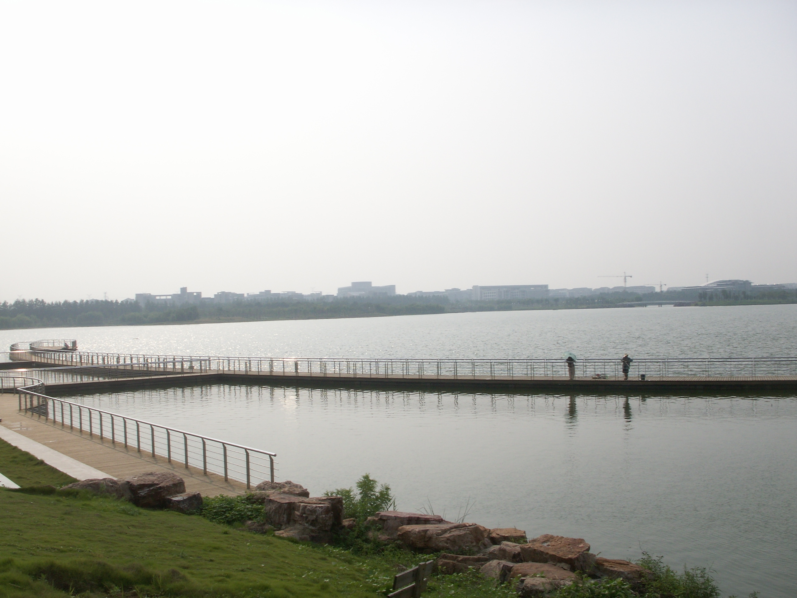

---
aliases:
  - places/feicui-hu
---

# Feicui Hu / Dachaidan · 翡翠湖·大柴旦

📍

Open in Maps

<a href="https://maps.apple.com/?ll=37.85,95.367&q=Feicui+Hu" target="_blank" style="display:block; padding:5px 0; text-decoration:none; font-size:13px; color:#333;">🍎 Apple Maps</a>
<a href="https://www.google.com/maps?q=37.85,95.367" target="_blank" style="display:block; padding:5px 0; text-decoration:none; font-size:13px; color:#333;">🌐 Google Maps</a>
<a href="https://uri.amap.com/marker?position=95.367,37.85&name=翡翠湖" target="_blank" style="display:block; padding:5px 0; text-decoration:none; font-size:13px; color:#333;">🗺 高德地图 (Amap)</a>
<a href="https://api.map.baidu.com/marker?location=37.85,95.367&title=翡翠湖&output=html" target="_blank" style="display:block; padding:5px 0; text-decoration:none; font-size:13px; color:#333;">🔵 百度地图 (Baidu)</a>

 <a href="https://www.google.com/search?q=Feicui%20Hu%20/%20Dachaidan%20%C2%B7%20%E7%BF%A1%E7%BF%A0%E6%B9%96%C2%B7%E5%A4%A7%E6%9F%B4%E6%97%A6%20China%20travel&tbm=isch" target="_blank" style="text-decoration:none; font-size:1.2rem;" title="Search images">🖼</a>

|                                           |                                           |
| ----------------------------------------- | ----------------------------------------- |
|  |  |

## Videos

<iframe width="100%" height="200" src="https://www.youtube-nocookie.com/embed/0ii_qi-ztxI" title="Qinghai Dachaidan Emerald Lake 0525A2" frameborder="0" allow="accelerometer; autoplay; clipboard-write; encrypted-media; gyroscope; picture-in-picture" allowfullscreen style="border-radius:8px;"></iframe>

footage of the emerald-colored salt lake pools at Dachaidan

<iframe width="100%" height="200" src="https://www.youtube-nocookie.com/embed/GfEKX327RTs" title="Emerald Lake — Qinghai Tour" frameborder="0" allow="accelerometer; autoplay; clipboard-write; encrypted-media; gyroscope; picture-in-picture" allowfullscreen style="border-radius:8px;"></iframe>

short travel video of the jade-green waters

<iframe width="100%" height="200" src="https://www.youtube-nocookie.com/embed/BZICUTXhZS4" title="Three Magical Lakes of Qinghai: Qinghai Lake · Emerald Lake · Chaka Salt Lake" frameborder="0" allow="accelerometer; autoplay; clipboard-write; encrypted-media; gyroscope; picture-in-picture" allowfullscreen style="border-radius:8px;"></iframe>

comparison of all three major Qinghai lake destinations

## Overview

Feicui Hu — "Jade Lake" (翡翠湖) — is the collective name for a series of shallow salt lakes clustered in the Qaidam Basin near Dachaidan (大柴旦), colored in shades of turquoise, emerald, cobalt, and jade-green that seem digitally altered in photographs but are entirely natural in person. The colors come from the interaction of different mineral concentrations — potassium, magnesium, lithium, and boron salts — with halophilic algae and brine shrimp that produce carotenoids. Different basins at different depths register entirely different colors, sometimes meters apart.

The Qaidam Basin itself is one of the most mineral-rich landscapes in Asia: a high-altitude (2,700–3,200m) inland basin that was once a sea, now thoroughly desiccated, leaving salt flats, mineral lakes, and otherworldly formations across an area the size of Portugal. The Chinese government has developed much of the basin for industrial extraction of lithium, potassium, and other minerals — and the tension between that industrial activity and the landscape's extraordinary beauty gives Feicui Hu an edge that more conventionally scenic places lack. You are in the middle of a working mineral extraction zone, and some of the most beautiful colors are byproducts of that process.

Internationally, Feicui Hu remains little-known — it has no significant presence in Western travel media and receives a fraction of the Chinese tourism that Chaka or Qinghai Lake do. This means you can often walk directly to the lake edge with few other visitors, no staged photography crowds, and complete silence except for the wind. On a clear afternoon in July, the combination of the colored lakes, the white salt margins, the distant mountains, and the immense sky is among the most visually striking things on this entire route.

## What to See & Do

- Drive slowly through the lake area — the best views often appear unexpectedly from the road, requiring no hike
- Walk to the nearest lake edge for close-up views of the color gradients, mineral crystals forming at the margins, and the reflections
- Look for the color contrasts: a single body of water can shift from deep cobalt to bright turquoise to pale jade over 50 metres
- Photograph in afternoon light — the low sun at 4–5pm produces the best saturation in the water colors
- Explore the salt formations at the lake margins — crystalline structures that grow overnight as the water evaporates

## Best Time to Visit

June through September. July afternoons offer good light and stable weather. Morning visits are also worthwhile for reflections on calmer water. Avoid midday when the light becomes flat and harsh.

## Practical Tips

- **Tickets:** As of 2025–2026, no formal ticket is required — the area is accessible by road without a gate. Check locally for any changes.
- **Access:** Self-drive is the only practical option. The main lake area is accessible by normal paved road; some secondary viewing spots may require short walks on unpaved salt surfaces
- **Footwear:** Same advice as Chaka — salt brine will destroy leather shoes. Bring sandals or old shoes.
- **Getting there:** ~100km west of Delingha on G315, approximately 1 hour. Dachaidan town is the nearest base.
- **Overnight:** Dachaidan has adequate mid-range hotels; book in advance in July

## Why It's Worth It

Most first-time visitors to China see ancient temples and busy cities — Feicui Hu is something else entirely: an alien mineral landscape that looks like the surface of a different planet, almost entirely unknown outside China, requiring no ticket, no queue, and no crowd to interpret it for you.
