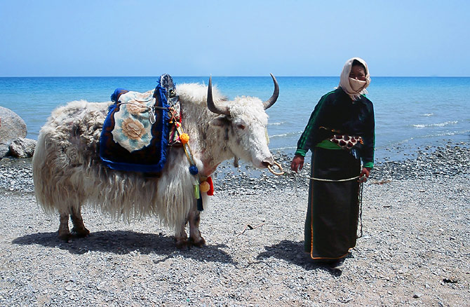
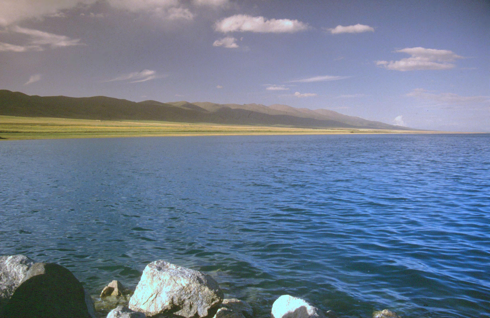

---
aliases:
  - places/qinghai-lake
---

# Qinghai Lake · 青海湖

📍

Open in Maps

<a href="https://maps.apple.com/?ll=36.9,100.183&q=Qinghai+Lake" target="_blank" style="display:block; padding:5px 0; text-decoration:none; font-size:13px; color:#333;">🍎 Apple Maps</a>
<a href="https://www.google.com/maps?q=36.9,100.183" target="_blank" style="display:block; padding:5px 0; text-decoration:none; font-size:13px; color:#333;">🌐 Google Maps</a>
<a href="https://uri.amap.com/marker?position=100.183,36.9&name=青海湖" target="_blank" style="display:block; padding:5px 0; text-decoration:none; font-size:13px; color:#333;">🗺 高德地图 (Amap)</a>
<a href="https://api.map.baidu.com/marker?location=36.9,100.183&title=青海湖&output=html" target="_blank" style="display:block; padding:5px 0; text-decoration:none; font-size:13px; color:#333;">🔵 百度地图 (Baidu)</a>

 <a href="https://www.google.com/search?q=Qinghai%20Lake%20%C2%B7%20%E9%9D%92%E6%B5%B7%E6%B9%96%20China%20travel&tbm=isch" target="_blank" style="text-decoration:none; font-size:1.2rem;" title="Search images">🖼</a>

|                                                 |                                                 |
| ----------------------------------------------- | ----------------------------------------------- |
|  |  |

## Videos

<iframe width="100%" height="200" src="https://www.youtube-nocookie.com/embed/2tc4tt9WqO4" title="Cycling Around Qinghai Lake: A Ride Like No Other" frameborder="0" allow="accelerometer; autoplay; clipboard-write; encrypted-media; gyroscope; picture-in-picture" allowfullscreen style="border-radius:8px;"></iframe>

solo cyclist circumnavigates China's largest lake

<iframe width="100%" height="200" src="https://www.youtube-nocookie.com/embed/g8iLyRb8eGs" title="I was riding solo the Qinghai Lake" frameborder="0" allow="accelerometer; autoplay; clipboard-write; encrypted-media; gyroscope; picture-in-picture" allowfullscreen style="border-radius:8px;"></iframe>

personal cycling vlog around the lake shore

<iframe width="100%" height="200" src="https://www.youtube-nocookie.com/embed/G8GDylFCDpU" title="Bicycle touring around Qinghai Lake, China" frameborder="0" allow="accelerometer; autoplay; clipboard-write; encrypted-media; gyroscope; picture-in-picture" allowfullscreen style="border-radius:8px;"></iframe>

touring cyclist perspective of the full circuit

## Overview

Qinghai Lake is the largest lake in China and the largest saltwater lake in Central Asia, covering 4,583 square kilometres at an altitude of 3,196 metres. Its scale is difficult to convey in photographs: standing on the north shore, the far edge simply disappears into the horizon, more like a sea than a lake. The water is a deep, saturated blue — the kind of blue that seems artificially vivid in person, the result of the altitude, the mineral content, and the clarity of the high-plateau atmosphere.

The lake is sacred in Tibetan Buddhism. It is called Tso Ngonpo (ཚོ་སྔོན་པོ) in Tibetan, meaning "Blue Lake," and features prominently in the spiritual geography of the plateau. Several small islands in the lake have historically been sites of meditation retreat. The island of Bird Island (鸟岛, Niǎo Dǎo) on the western shore hosts one of China's most important migratory bird sanctuaries: each spring and summer, bar-headed geese, black-necked cranes, and brown-headed gulls arrive in vast numbers. The bar-headed goose in particular is remarkable — it migrates directly over the Himalayas at altitudes above 7,000 metres.

The lake has also become famous for cycling. The annual Qinghai Lake International Road Cycling Race (环青海湖国际公路自行车赛) draws professional teams from around the world for a multi-stage race circumnavigating the lake — a circuit of roughly 360 kilometres. In summer, recreational cyclists and tourists on rented bikes fill the north shore roads, and the visual — cyclist silhouettes against that blue expanse — is one of the iconic images of modern western China.

## What to See & Do

- Walk the north shore at Erlangjian Scenic Area (二郎剑景区): long wooden boardwalks out over the shallow edge of the lake, with the best photography angles
- Watch for bar-headed geese along the shoreline — these are the birds that fly over Everest
- Rent a bicycle from vendors near Erlangjian and ride a few km along the lakeshore road
- Photograph the prayer flag poles and small Tibetan stupas on the hillsides above the shore
- If time allows, drive a short distance west to find emptier, unmanicured sections of shore for a quieter experience

## Best Time to Visit

July is ideal: water levels are at their highest, surrounding hills are green, and the rapeseed fields on the western shore are in full bloom. The lake freezes solid in winter (December–March). Spring and autumn can be beautiful but cold and windy.

## Practical Tips

- **Tickets:** Erlangjian Scenic Area ~¥100/person; includes access to the boardwalks and lakeshore area
- **Opening hours:** Approximately 8:00am–6:00pm; ticket office may close earlier
- **Getting there:** ~110km west of Xining on G109/S101, approximately 1.5–2 hours. From Riyueshan Pass, it's a further 30 minutes northwest.
- **Crowds:** July is peak season — arrive by 4:00pm to beat the worst crowds at the main viewpoints
- **Facilities:** Full tourist infrastructure at Erlangjian — parking, toilets, souvenir shops, basic restaurants

## Why It's Worth It

There are large lakes elsewhere in the world, but there is nothing quite like standing beside 4,500 square kilometres of intensely blue water at altitude, with Tibetan prayer flags snapping in the plateau wind — it is one of those landscapes that physically recalibrates your sense of scale.
