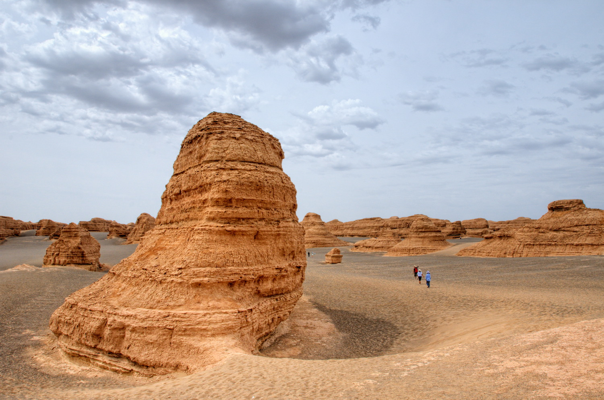
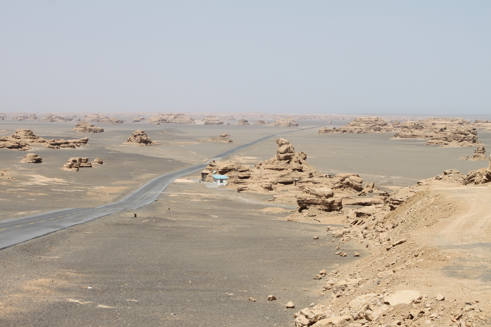
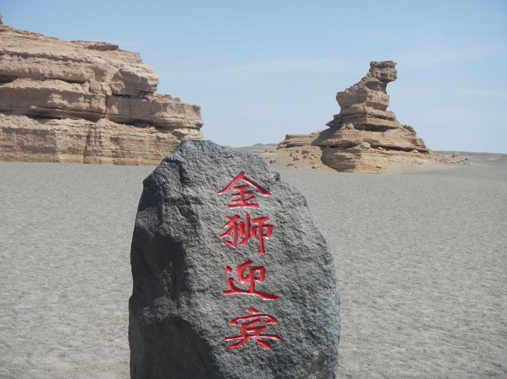

---
aliases:
  - places/yardang
---

# Yardang National Geopark · 雅丹魔鬼城

📍

Open in Maps

<a href="https://maps.apple.com/?ll=40.483,93.1&q=Yardang+Geopark" target="_blank" style="display:block; padding:5px 0; text-decoration:none; font-size:13px; color:#333;">🍎 Apple Maps</a>
<a href="https://www.google.com/maps?q=40.483,93.1" target="_blank" style="display:block; padding:5px 0; text-decoration:none; font-size:13px; color:#333;">🌐 Google Maps</a>
<a href="https://uri.amap.com/marker?position=93.1,40.483&name=雅丹魔鬼城" target="_blank" style="display:block; padding:5px 0; text-decoration:none; font-size:13px; color:#333;">🗺 高德地图 (Amap)</a>
<a href="https://api.map.baidu.com/marker?location=40.483,93.1&title=雅丹魔鬼城&output=html" target="_blank" style="display:block; padding:5px 0; text-decoration:none; font-size:13px; color:#333;">🔵 百度地图 (Baidu)</a>

 <a href="https://www.google.com/search?q=Yardang%20National%20Geopark%20%C2%B7%20%E9%9B%85%E4%B8%B9%E9%AD%94%E9%AC%BC%E5%9F%8E%20China%20travel&tbm=isch" target="_blank" style="text-decoration:none; font-size:1.2rem;" title="Search images">🖼</a>

|                                       |                                       |
| ------------------------------------- | ------------------------------------- |
|  |  |

## Videos

<iframe width="100%" height="200" src="https://www.youtube-nocookie.com/embed/Wog6wcMCoPE" title="Silk Road 10 — Dunhuang Yadan National Geopark" frameborder="0" allow="accelerometer; autoplay; clipboard-write; encrypted-media; gyroscope; picture-in-picture" allowfullscreen style="border-radius:8px;"></iframe>

Travel footage driving through the formation areas with commentary on the geology and the Silk Road context

## Overview

Dunhuang Yardang National Geopark — known to locals and travellers as 魔鬼城, "Devil City" — is one of the most unearthly landscapes in China. Located approximately 180 kilometres northwest of Dunhuang in the Gansu desert, the park preserves an extraordinary field of wind-sculpted rock formations called yardangs: ridges, towers, and mesas of compressed silt and clay that have been carved by desert winds over millions of years into forms that suggest ruined buildings, crouching animals, and ghostly figures. The Chinese name "Devil City" comes from the sound the wind makes at night, howling and shrieking through the gaps between formations in a way that travellers for centuries described as demonic. The effect is genuinely eerie: standing in the late afternoon light among hundreds of pale golden pillars that stretch to the horizon, it is not difficult to understand why Silk Road caravans detoured around this place after dark.

The geology here is ancient and specific. During the Cretaceous period — roughly 135 million years ago — this region was a vast inland lake. Layers of soft lacustrine sediment were deposited, then dried and compressed as the climate changed. Over millions of years, prevailing winds from the northwest eroded the softer materials and left behind a landscape of hardened ridges aligned roughly parallel to the wind direction. The largest formation area covers nearly 400 square kilometres. Scientists consider Dunhuang Yardang to be the most mature and visually spectacular example of this landform type in the world.

For first-time visitors to China's northwest, the geopark delivers something genuinely foreign to the visual vocabulary of most travellers — a landscape with no analogue in Europe or North America. The formations have been given names: the Sphinx, the Golden Lion, the Peacock, the Camel, the Mongolian Yurt. Standing on the viewing platform at sunset watching the low light turn the pale formations amber and rust, while the wind picks up and starts to moan through the rock corridors, is one of the most memorable experiences available anywhere in China.

## What to See & Do

- **West Sea Fleet formation** — the most dramatic cluster of large yardangs, resembling a fleet of stone ships frozen in an inland sea; best photographed at sunset
- **Sphinx formation** — a naturally sculpted mesa that bears an uncanny resemblance to the Egyptian monument; named and photographed from a specific viewing angle
- **Golden Lion** — one of the best-named formations, recognisable as a reclining lion from the standard viewpoint
- **Sunset viewing platform** — the designated spot for watching the sun set behind the formations; arrive 30 minutes before sunset for position
- **Night tour (optional)** — some operators run evening visits specifically to hear the wind; surreal and memorable, but logistics require either a 3rd night in Dunhuang or very early return

## Best Time to Visit

May to October. July visits work well — the sun sets late (around 8pm), giving excellent golden hour light on the formations without requiring an extremely early start. Temperatures at the site in July can exceed 40°C in the middle of the day; the standard tour runs morning or evening specifically to avoid midday heat. **Sunset is the best time by a wide margin** — the formations glow amber and red in the low light in a way the midday white sun completely flattens. Arrive by 6:30pm for the 8pm sunset in July.

## Practical Tips

- **Distance:** 180km northwest of Dunhuang city; approximately 2 hours each way on a dedicated road
- **Access:** No public transport; must join a tour or hire a private car/driver from Dunhuang (~¥300–400/car for the round trip)
- **Entry fee:** ~¥120 per person, including the obligatory shuttle bus that takes visitors between the main viewing areas within the park
- **Duration:** Allow 2–3 hours in the park itself, plus 4 hours of driving — plan for a minimum 6-hour excursion from Dunhuang
- **Itinerary fit:** Best added as a half-day extension to the Day 4 Dunhuang day, either as a very early morning departure (leave Dunhuang by 5am, be at the park for sunrise, return by 11am before heat peaks) or by spending a third night in Dunhuang and treating it as Day 5 before driving to Jiayuguan
- **Photography:** Bring a wide-angle lens; the scale of the formations is enormous and a normal focal length doesn't capture them adequately. A tripod is useful for the evening low-light conditions.
- **Bring:** Water (a lot of it), sunscreen, a light windbreaker for the evening — wind in the geopark is constant and can be cold even in July once the sun drops

## Why It's Worth It

If Dunhuang is already the most otherworldly stop on this trip, the Yardang Geopark is what you add when you want to leave Earth entirely.
