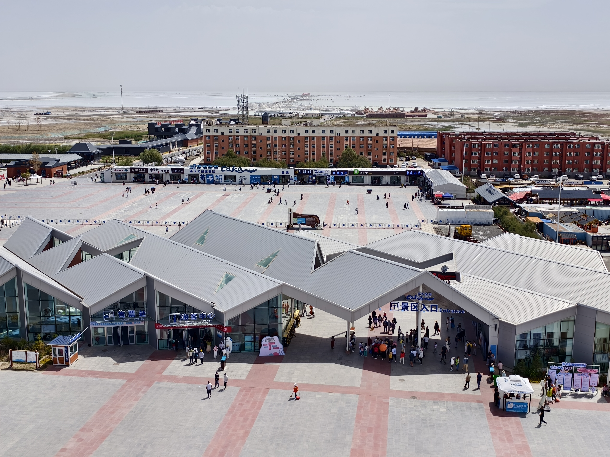
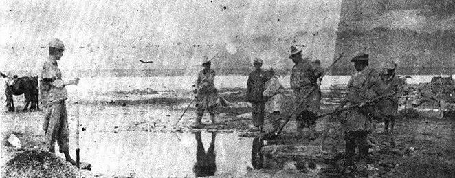
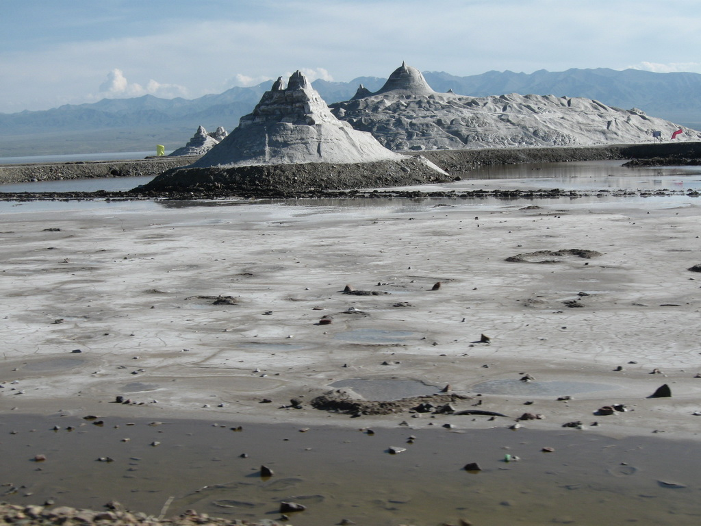

# Chaka Salt Lake · 茶卡盐湖

|                                                       |                                                       |
| ----------------------------------------------------- | ----------------------------------------------------- |
|  |  |

## Overview

Chaka Salt Lake has acquired a powerful reputation in the last decade as "China's sky mirror" (天空之镜) — a place where a thin film of water over a flat white salt crust creates a perfect reflection of the sky, dissolving the boundary between ground and air until visitors appear to walk through clouds. This is not exaggeration: when conditions are right, at sunrise with no wind, the effect is genuinely disorienting and extraordinary.

The lake sits at 3,059 metres in Ulan County, Qinghai Province, in the northeastern corner of the Qaidam Basin. It covers roughly 105 square kilometres and has been commercially mined for salt since the Han Dynasty — over 2,000 years of continuous extraction. Industrial salt mining still operates here, and the narrow-gauge railway that once served the mining operation has been repurposed as a tourist train that carries visitors across the flat salt surface. Piles of extracted salt, rusted mining equipment, and the eerie geometry of the salt flat give the landscape an industrial-surrealist quality that the reflections then transform into something unearthly.

The water level at Chaka is shallow and seasonal. In early morning before wind disturbs the surface, the reflection is mirror-flat. By midday, tourist foot traffic, wind, and evaporation in the summer heat produce ripples that break the effect. This is why the sunrise visit is not optional — it is the entire point of staying overnight in Chaka.

## What to See & Do

- Walk or take the tourist train out onto the salt flat at sunrise for the mirror reflection — bring bare feet or waterproof sandals, the water is 2–10cm deep depending on season
- Photograph the industrial salt piles and equipment at the lake's edge — genuinely photogenic in a way that feels unlike anywhere else
- Watch the light change: the white salt catches the orange and pink of early sunrise, then transitions to blinding white as the sun rises
- Look for brine shrimp in the shallow water — tiny organisms that contribute to the color
- Visit the salt sculpture area where workers have carved figures from extracted salt blocks

## Best Time to Visit

July mornings are ideal. Be at the lake by 6:30–7:00am before wind picks up and before other tourists arrive. The mirror effect degrades significantly after 9:00am on windless days and is often gone entirely by mid-morning on windy days. Afternoon visits are still worthwhile for the landscape and salt formations but you will likely not see the reflection.

## Practical Tips

- **Tickets:** ~¥100/person, includes access to the salt flat and optional tourist train (train may have separate small fee)
- **Opening hours:** Scenic area opens at 7:00am; arrive slightly before and wait at the gate
- **Footwear:** Bring sandals or old shoes you don't mind getting salt-encrusted; the brine is corrosive to leather
- **Clothing:** The white salt surface reflects UV intensely — sunscreen, hat, and sunglasses are essential even at sunrise
- **Getting there:** Chaka town is ~170km east of Delingha and ~170km west of the Qinghai Lake north shore, on G315. From Qinghai Lake, approximately 2 hours by car.
- **Overnight:** Several budget guesthouses in Chaka town; book ahead in July as it is extremely popular with Chinese tourists

## Why It's Worth It

Photographs circulate constantly online, but standing on the actual salt flat at dawn — feet in cool brine, the entire sky mirrored beneath you, the Kunlun Mountains framing the horizon — is one of those experiences that no image fully prepares you for.

## Videos

- [CHAKA SALT LAKE: China's Incredible MIRROR OF THE SKY! | Qinghai Travel Guide](https://www.youtube.com/watch?v=rvGn31AUYhI) — English-language travel guide covering the mirror reflection experience and practical tips
- [How to get to Chaka Salt Lake](https://www.youtube.com/watch?v=u5wjVLlEZ-k) — logistics and transport from Xining
- [What to expect at Chaka Salt Lake](https://www.youtube.com/watch?v=vf8XzN9wKHY) — honest on-the-ground account of the visit experience
