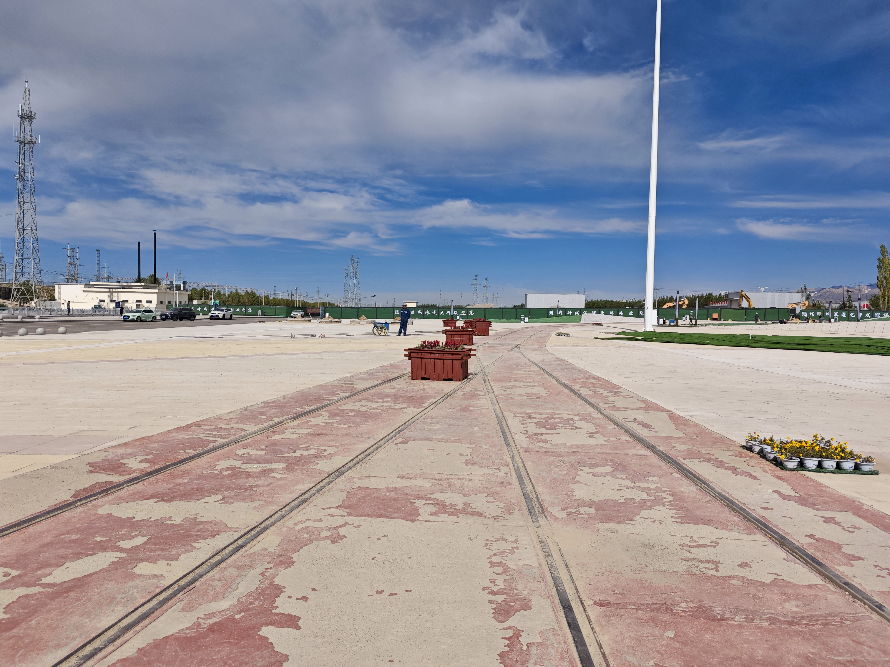

# Delingha & Haizi Poetry Park · 德令哈·海子诗歌园

📍

Open in Maps

<a href="https://maps.apple.com/?ll=37.367,97.367&q=Delingha" target="_blank" style="display:block; padding:5px 0; text-decoration:none; font-size:13px; color:#333;">🍎 Apple Maps</a>
<a href="https://www.google.com/maps?q=37.367,97.367" target="_blank" style="display:block; padding:5px 0; text-decoration:none; font-size:13px; color:#333;">🌐 Google Maps</a>
<a href="https://uri.amap.com/marker?position=97.367,37.367&name=德令哈" target="_blank" style="display:block; padding:5px 0; text-decoration:none; font-size:13px; color:#333;">🗺 高德地图 (Amap)</a>
<a href="https://api.map.baidu.com/marker?location=37.367,97.367&title=德令哈&output=html" target="_blank" style="display:block; padding:5px 0; text-decoration:none; font-size:13px; color:#333;">🔵 百度地图 (Baidu)</a>

 <a href="https://www.google.com/search?q=Delingha%20%26%20Haizi%20Poetry%20Park%20%C2%B7%20%E5%BE%B7%E4%BB%A4%E5%93%88%C2%B7%E6%B5%B7%E5%AD%90%E8%AF%97%E6%AD%8C%E5%9B%AD%20China%20travel&tbm=isch" target="_blank" style="text-decoration:none; font-size:1.2rem;" title="Search images">🖼</a>

## Overview

Delingha (德令哈) is a small city of roughly 90,000 people deep in the Qaidam Basin, surrounded by desert and salt marsh, ringed by distant mountains that are almost always slightly hazy. It would be a minor transit point on the journey west — except that on August 26, 1988, a 25-year-old poet named Haizi (海子) stopped here overnight while traveling by train, alone, and wrote one of the most beloved poems in modern Chinese literature.

The poem is called "姐姐，今夜我在德令哈" — "Sister, Tonight I Am in Delingha." It is spare and melancholic, written to an imaginary or real sister, confronting the poet's loneliness against the immensity of the landscape. The line that resonates most widely: "今夜我不关心人类，我只想你" — "Tonight I do not care about humanity, I only think of you." Haizi died by suicide less than a year later, in March 1989, on a railway track outside Beijing at age 25. He has become one of the tragic icons of Chinese lyric poetry — a figure comparable to Keats or Rimbaud in his intensity and brevity.

The Haizi Poetry Park (海子诗歌园) was established on the southern edge of the city as a memorial. It is a quiet, well-maintained small park with stone-carved verses, a bronze statue of the young poet, a small lake ringed by willows, and a modest exhibition space. The park attracts literary pilgrims from across China — you will find people reading his poems aloud here, photographing the carved lines, sitting in silence. For the Italians in the group, the comparison to visiting Leopardi's hometown of Recanati is not far off: a minor place made significant entirely by one person's imagination passing through it.

Delingha is also the gateway to the Qaidam Basin proper, and the surrounding landscape — flat, salt-white, surrounded by low reddish hills — has its own austere beauty that makes Haizi's poem feel inevitable. A person would feel lonely here. It is the right place for that poem.

## What to See & Do

- Walk the Haizi Poetry Park slowly: read the carved verses on the stone tablets along the path
- Find the bronze statue of Haizi seated — a quiet, young-looking figure looking westward
- Visit the small exhibition hall with photos and manuscripts from his brief life
- Walk to the small artificial lake in the park's centre — willows, benches, complete quiet
- Look for the line "今夜我不关心人类，我只想你" carved in stone — the most photographed inscription
- Have lunch at one of the small local restaurants near the park; Delingha has good hand-pulled noodles (拉条子)

## Best Time to Visit

July is fine. The park is pleasant in summer. Delingha is a brief stop (1–2 hours) rather than a destination in itself — the value is the specific atmosphere of a remote city that one poem made famous.

## Practical Tips

- **Tickets:** The park is free or has a nominal entry fee (check locally)
- **Opening hours:** Generally 8:00am–6:00pm
- **Getting there:** ~230km west of Chaka on G315, approximately 2.5 hours by car. The drive passes through classic Qaidam Basin landscape — flat, mineral, immense.
- **Facilities:** Toilets and basic seating throughout the park; restaurants and shops in the surrounding streets
- **Fuel:** Fill the tank in Delingha before continuing west — fuel stations become sparser

## Why It's Worth It

Most tourists come to China for ancient dynasties and famous mountains, but Delingha shows a different kind of cultural depth: a modern poet, a single night, a handful of lines — and a whole city transformed into a place of literary pilgrimage. It is unexpectedly moving.
