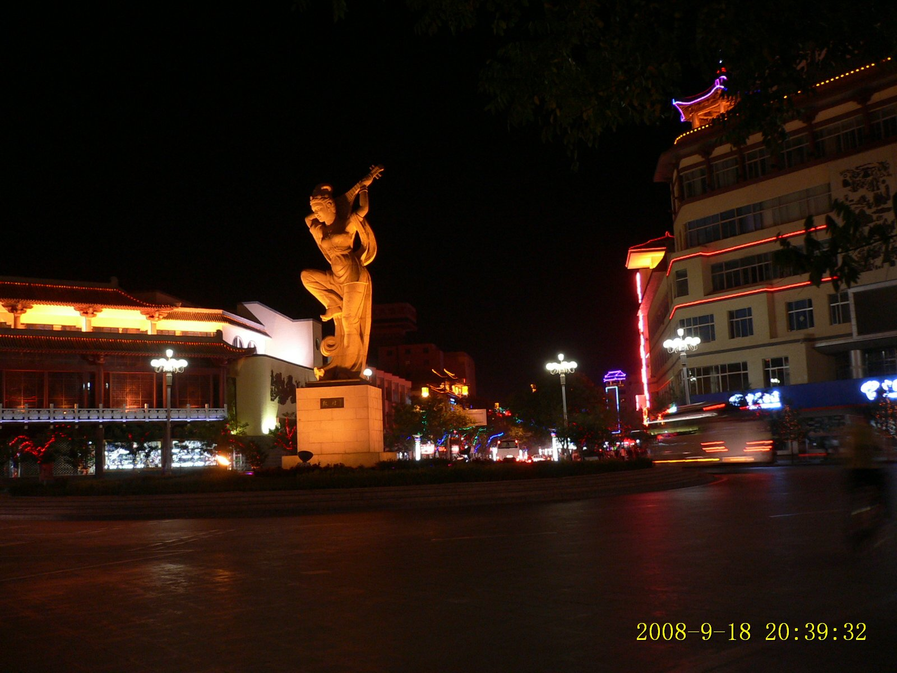
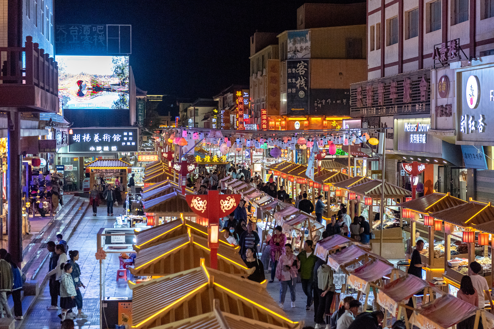
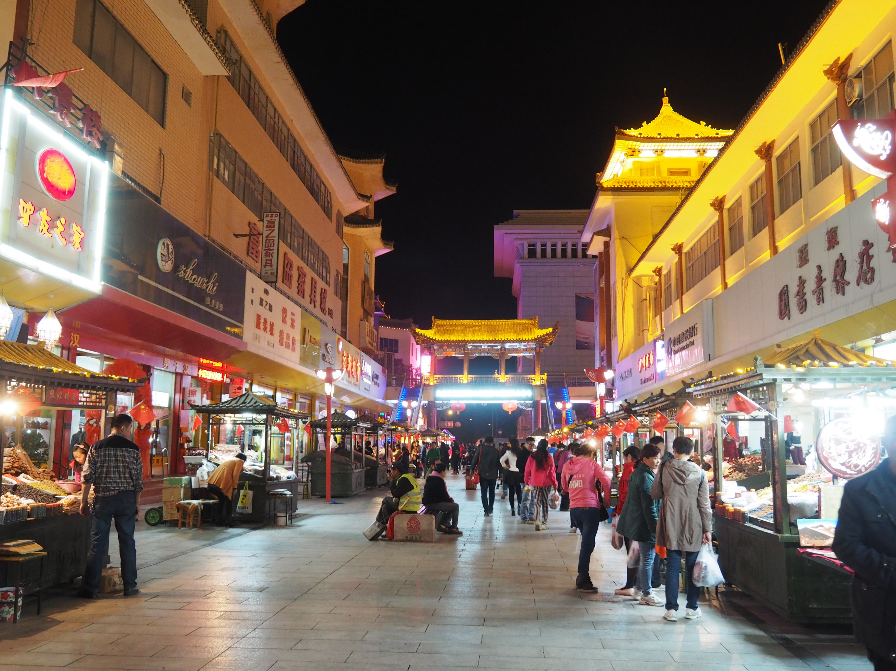

# Dunhuang Shazhou Night Market · 沙州夜市

📍

Open in Maps

<a href="https://maps.apple.com/?ll=40.142,94.662&q=Dunhuang+Night+Market" target="_blank" style="display:block; padding:5px 0; text-decoration:none; font-size:13px; color:#333;">🍎 Apple Maps</a>
<a href="https://www.google.com/maps?q=40.142,94.662" target="_blank" style="display:block; padding:5px 0; text-decoration:none; font-size:13px; color:#333;">🌐 Google Maps</a>
<a href="https://uri.amap.com/marker?position=94.662,40.142&name=沙州夜市" target="_blank" style="display:block; padding:5px 0; text-decoration:none; font-size:13px; color:#333;">🗺 高德地图 (Amap)</a>
<a href="https://api.map.baidu.com/marker?location=40.142,94.662&title=沙州夜市&output=html" target="_blank" style="display:block; padding:5px 0; text-decoration:none; font-size:13px; color:#333;">🔵 百度地图 (Baidu)</a>

| | |
|--|--|
|  |  |

## Videos

<iframe width="100%" height="200" src="https://www.youtube-nocookie.com/embed/v4tFAjWUIY0" title="CRAZY Desert Food Feast! China Dunhuang Food Tour of Hexi Corridor" frameborder="0" allow="accelerometer; autoplay; clipboard-write; encrypted-media; gyroscope; picture-in-picture" allowfullscreen style="border-radius:8px;"></iframe>

extended street food walkthrough of the Shazhou night market with tasting commentary

<iframe width="100%" height="200" src="https://www.youtube-nocookie.com/embed/IRhr48Y6Gp8" title="3 Days Dunhuang Travel: Mogao Caves, Great Wall and Desert | China Travel ep.3" frameborder="0" allow="accelerometer; autoplay; clipboard-write; encrypted-media; gyroscope; picture-in-picture" allowfullscreen style="border-radius:8px;"></iframe>

covers the night market as part of a full Dunhuang itinerary

## Overview

Shazhou Night Market (沙州夜市) is the beating commercial and social heart of Dunhuang in summer evenings — a pedestrian street roughly 400 metres long that transforms after sunset into a dense, loud, aromatic corridor of street food stalls, souvenir sellers, musicians, and crowds that stay until midnight or beyond. For a group arriving from three days of near-empty desert and basin highways, it is a deliberate and welcome shock: the density, the noise, the heat of the grills, the competing smells of cumin and lamb fat and dried apricots are all turned up high.

Dunhuang sits at the far western end of the Hexi Corridor, the narrow passage through which the Silk Road connected Central China to Central Asia for two millennia. The food culture here reflects that position directly. The dominant flavors are those of the Northwest Muslim (Hui) and Uyghur culinary traditions: lamb as the dominant protein, cumin as the dominant spice, hand-stretched wheat noodles as the dominant carbohydrate. The Silk Road also brought dried fruits and nuts — Dunhuang's apricots (白杏, white apricots) are regionally famous and appear in stalls everywhere in dried, fresh, and preserved forms. Camel milk, once the sustenance of desert caravan travelers, now appears in the more whimsical form of camel milk ice cream.

The night market is not a curated tourist experience in the way that many Chinese food streets have become — it is genuinely where local Dunhuang residents eat on summer evenings, sitting on low plastic stools at outdoor tables, sharing skewers and cold beer under string lights while the temperature drops from the 40°C afternoon to a comfortable 25°C night.

## What to See & Do

- Roasted lamb skewers (烤羊肉串, kǎo yángròu chuàn) — the signature item; order in multiples of ten, eat immediately from the skewer
- Hand-pulled noodles (拉条子, lā tiáo zi) — thicker and chewier than southern noodles, served with a stir-fried lamb and vegetable sauce
- Liangpi (凉皮) — cold wheat skin noodles with chili oil and vinegar; essential hot-weather street food
- Dunhuang white apricots — sweet, slightly tart; eat fresh from a bag
- Camel milk ice cream — novelty item worth trying; genuinely mild and slightly sweet
- Roasted whole fish and flatbreads (烤馕, kǎo náng) — Silk Road staples
- Walk the full length twice: once to survey, once to eat

## Best Time to Visit

The night market runs May through October, with July and August being peak season. Arrive around 7:00–7:30pm as temperatures are dropping and stalls are hitting full stride. Budget 1.5–2 hours for a full experience.

## Practical Tips

- **Cost:** Budget ¥60–100/person for a full meal of skewers, noodles, fruit, and drinks
- **Payment:** Most stalls accept WeChat Pay and Alipay; some accept cash; few accept cards
- **Language:** Point-and-order works everywhere; pictures on menus are standard
- **Getting there:** The night market is in central Dunhuang, easily walkable from most hotels or a short taxi/DiDi ride
- **Hygiene:** Stick to stalls with high turnover — grills where the skewers are moving constantly are safest

## Why It's Worth It

After days in the empty basin, a first-time visitor to China who walks into Shazhou Night Market at 7:30pm on a July evening is getting an unfiltered hit of Chinese street life — the food, the noise, the generosity of a culture that treats eating in public as both pleasure and social ritual.
