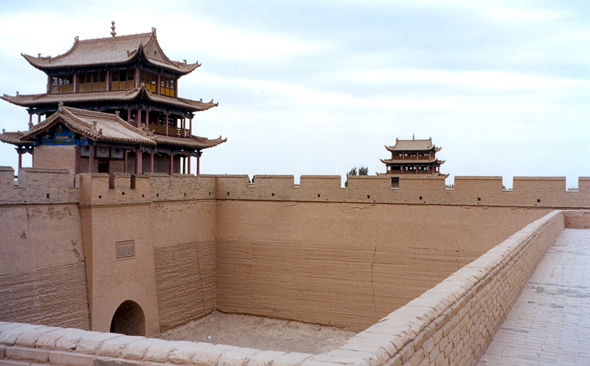
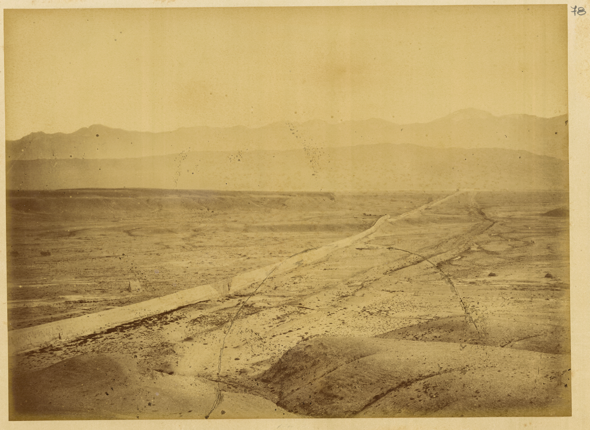
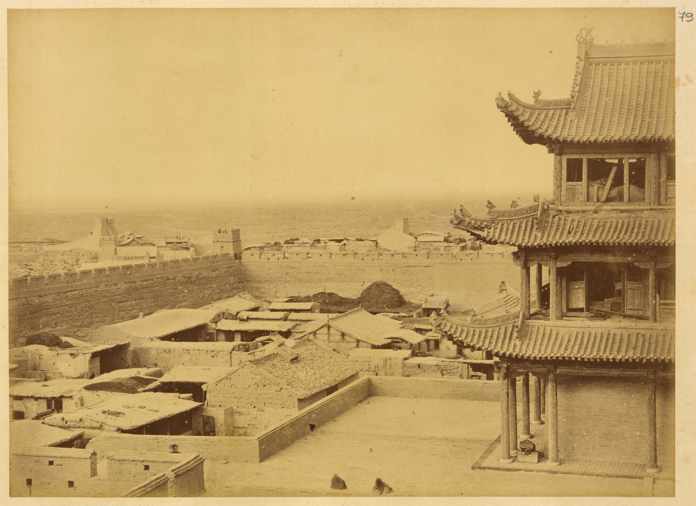

# Jiayuguan Fort · 嘉峪关城楼

| | |
|--|--|
|  |  |

## Overview

Jiayuguan Fort is the westernmost major fort of the Ming Dynasty Great Wall, built in 1372 at the narrowest point of the Hexi Corridor — a natural bottleneck between the Qilian Mountains to the south and the Mazong Mountains to the north, where the corridor squeezes to roughly 15 kilometres across before opening onto the desert steppes of Central Asia. It was designated "天下第一雄关" — "The Greatest Pass Under Heaven" — a claim that in the Ming Dynasty meant: the last point of Chinese civilization, beyond which the empire's writ did not run.

The fort's construction was strategic perfection. The site commands the only viable east-west passage through the mountains for hundreds of kilometres in either direction. The walls — 11 metres high, built from rammed earth faced with brick — form a nested series of enclosures: an outer wall, an inner walled courtyard, and a central citadel with two massive gate towers. The towers are three-storey wooden structures of the classic northern Chinese style, painted red and green, rising above the battlements. The whole complex is extraordinarily well-preserved, having escaped the wars that devastated so much of China's built heritage because the area was so remote.

For over 200 years, Jiayuguan was the point at which Chinese society officially ended. Officials exiled to the northwest passed through this gate into legal and social oblivion. Silk Road merchants passed through heading west into the Uyghur and Tibetan lands, carrying silk and returning with glassware, horses, and ideas. Garrison soldiers stationed here watched the desert for the dust clouds of approaching cavalry. One Ming-era official, on being posted to the western garrisons, wrote that passing through Jiayuguan was like passing through the gates of death. The gate is real and the metaphor was not casual — men stationed beyond it often did not return.

For visitors from Italy, the parallel to Roman frontier fortifications is immediate and not superficial: both represent an empire defining its limit, marking the boundary between civilization and what lay beyond, between the taxed and the untaxed, the governed and the ungovernable. The Great Wall at Jiayuguan is China's Hadrian's Wall, built at roughly the same historical moment in the life of each civilization when expansion was giving way to consolidation and defense.

## What to See & Do

- Walk the full circuit of the outer wall battlements for panoramic views of the Hexi Corridor and the Qilian Mountains to the south
- Enter the inner citadel and climb both gate towers (east-facing Guanghua Tower and west-facing Rouyuan Tower) — the west tower looks out toward the desert
- Find the "hanging wall" (悬壁长城, Xuánbì Chángchéng) — a section of wall that climbs straight up a steep mountain slope north of the fort; 10km away but visible and worth the detour
- Look for the legend: a single loose brick placed above the west gate, which a worker calculated was exactly the correct amount of material to build the entire fort — it has been there since 1372
- Walk through the Overcliff Pass Museum for context on the Silk Road and garrison history

## Best Time to Visit

Year-round; July is hot (30–35°C) but manageable with early morning or late afternoon timing. The fort looks most dramatic in late afternoon light when the shadows on the rammed-earth walls deepen.

## Practical Tips

- **Tickets:** ~¥120/person, includes the fort and adjacent sites
- **Opening hours:** 8:00am–6:00pm (summer hours); last entry 5:00pm
- **Duration:** 2.5–3 hours for a thorough visit; 1.5 hours for the essential circuit
- **Getting there:** ~6km from Jiayuguan city centre, approximately 15 minutes by taxi; the fort is visible from the highway
- **Guides:** English-speaking guides are available on-site for hire; recommended for context

## Why It's Worth It

You are standing at the exact point where an empire decided to stop — the literal edge of 2,000 years of Chinese civilization, looking west across the desert toward Dunhuang, Kashgar, and ultimately Rome. The weight of that position is fully present in the stones.

## Videos

- [JIAYUGUAN FORT at the end of the GREAT WALL OF CHINA!](https://www.youtube.com/watch?v=a2r4u3j11u8) — English travel vlog exploring the fort and its western Great Wall context
- [The Great Wall & the fort of Jiayuguan (CHINA) | Episode 1](https://www.youtube.com/watch?v=XOmG9wWP8NM) — documentary-style coverage of the fort and surrounding wall sections
