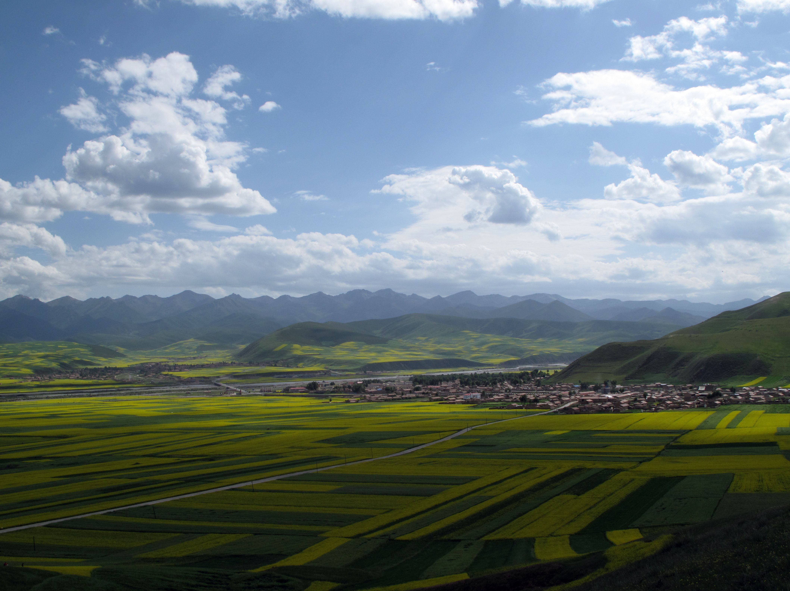
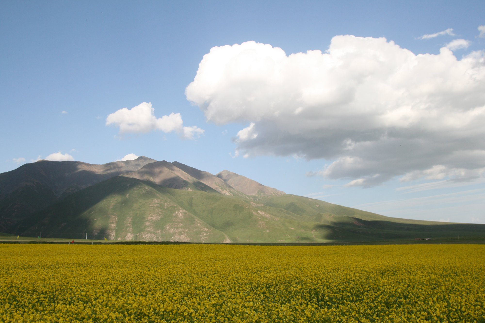

# Menyuan Rapeseed Flowers · 门源油菜花

📍

Open in Maps

<a href="https://maps.apple.com/?ll=37.383,101.617&q=Menyuan+Flowers" target="_blank" style="display:block; padding:5px 0; text-decoration:none; font-size:13px; color:#333;">🍎 Apple Maps</a>
<a href="https://www.google.com/maps?q=37.383,101.617" target="_blank" style="display:block; padding:5px 0; text-decoration:none; font-size:13px; color:#333;">🌐 Google Maps</a>
<a href="https://uri.amap.com/marker?position=101.617,37.383&name=门源油菜花" target="_blank" style="display:block; padding:5px 0; text-decoration:none; font-size:13px; color:#333;">🗺 高德地图 (Amap)</a>
<a href="https://api.map.baidu.com/marker?location=37.383,101.617&title=门源油菜花&output=html" target="_blank" style="display:block; padding:5px 0; text-decoration:none; font-size:13px; color:#333;">🔵 百度地图 (Baidu)</a>

| | |
|--|--|
|  |  |

## Overview

Menyuan County (门源回族自治县) in the northeastern corner of Qinghai Province hosts what is commonly described as the world's largest continuous rapeseed flower field — over 330,000 acres (roughly 133,000 hectares) of Brassica napus planted in the valley floor at 2,900 metres altitude, backed by the snow-capped ridgeline of the Qilian Mountains to the north and the lower Datong Mountains to the south. In peak bloom, the valley floor is an unbroken plane of brilliant yellow that extends to the base of the mountains — a color saturation that the altitude and clean air amplify to an almost painful intensity.

Rapeseed (油菜, yóucài) has been cultivated in this valley for centuries; the cool, short growing season at altitude produces a compressed bloom window — roughly three weeks in July — during which the entire valley flowers simultaneously. The timing of this route's passage through Menyuan (Day 6, around 4:00pm) coincides with peak bloom in a typical year. The yellow is not uniform: variations in planting dates and micro-climate produce subtle gradients across the field, and the color shifts as the sun angle changes through the afternoon.

The Qilian Mountains as a backdrop are themselves spectacular — a 800-kilometre range running northeast to southwest, with peaks above 5,500 metres, still carrying permanent snow and glaciers in July. The visual contrast of the yellow valley floor against the white peaks and blue sky is the composition that makes Menyuan's photographs iconic in Chinese nature photography. The drive through the valley on G227 passes directly through the fields — no special turnoff required, and the roadside stops are obvious: pull over where other cars have pulled over.

## What to See & Do

- Stop wherever the roadside composition looks best — there are no designated viewpoints, just the road through the valley
- Walk into the edge of the flower fields from the road shoulder; the plants are at chest height and you can photograph the Qilian peaks above the flower canopy
- Look for early morning light on the mountains if passing through before 9:00am on Day 6; late afternoon light (4:00–6:00pm) is equally good
- Find elevated ground — small rises or embankments — for elevated shots over the field toward the mountains
- Wildflowers on the field margins: the valley supports a wide diversity of alpine meadow flowers among and around the crop fields

## Best Time to Visit

Mid-July to early August is peak bloom. The precise peak varies by year depending on spring temperatures — in an average year, the fields are fully open from July 15 to August 5. This route passes through on July 23, which falls squarely within the expected bloom window.

## Practical Tips

- **Tickets:** No ticket required — the fields are roadside and publicly accessible
- **Getting there:** G227 runs through the heart of the Menyuan valley between Zhangye (Minle) to the west and Xining to the east; the route passes directly through on Day 6
- **Stop time:** 30–45 minutes is sufficient for photographs; longer if the light is exceptional
- **Facilities:** Small roadside stalls sell snacks and cold drinks near the main stopping points; otherwise bring your own
- **Traffic:** July is peak season and the road can be slow through the valley — factor in 30–45 minutes extra travel time

## Why It's Worth It

A high plateau valley turned entirely yellow from horizon to mountain, with snow peaks behind it — this is one of those landscapes that reminds you why you came somewhere this far from home.

## Videos

<iframe width="100%" height="200" src="https://www.youtube-nocookie.com/embed/ARlqQy-eXKg" title="Rapeseed flowers in Qilian Mountain, Menyuan County, Qinghai Province, China" frameborder="0" allow="accelerometer; autoplay; clipboard-write; encrypted-media; gyroscope; picture-in-picture" allowfullscreen style="border-radius:8px;"></iframe>

aerial and ground footage of the Menyuan rapeseed fields with the Qilian mountains as backdrop

<iframe width="100%" height="200" src="https://www.youtube-nocookie.com/embed/Xjc8XhzAlM0" title="Live: Stunning rapeseed flowers bloom in Qinghai – Ep. 8" frameborder="0" allow="accelerometer; autoplay; clipboard-write; encrypted-media; gyroscope; picture-in-picture" allowfullscreen style="border-radius:8px;"></iframe>

live broadcast footage of the bloom at peak season

<iframe width="100%" height="200" src="https://www.youtube-nocookie.com/embed/8oNERtR0IN8" title="Golden sea of rapeseed flowers attract tourists in Qinghai" frameborder="0" allow="accelerometer; autoplay; clipboard-write; encrypted-media; gyroscope; picture-in-picture" allowfullscreen style="border-radius:8px;"></iframe>

news-style coverage of the annual bloom and visitor experience

