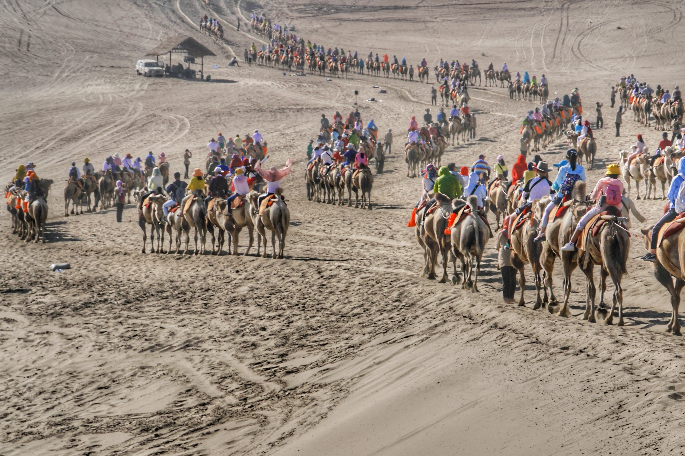
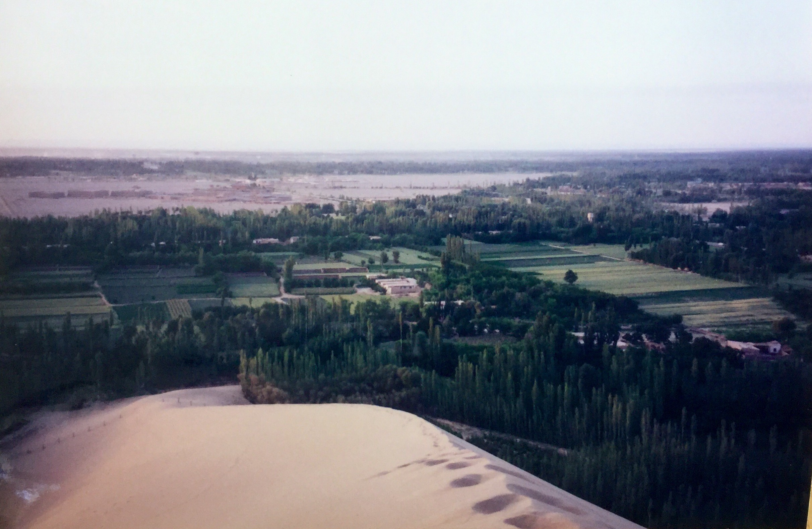

# Mingsha Sand Dunes & Crescent Moon Spring · 鸣沙山·月牙泉

📍

Open in Maps

<a href="https://maps.apple.com/?ll=40.085,94.674&q=Mingsha+Dunes" target="_blank" style="display:block; padding:5px 0; text-decoration:none; font-size:13px; color:#333;">🍎 Apple Maps</a>
<a href="https://www.google.com/maps?q=40.085,94.674" target="_blank" style="display:block; padding:5px 0; text-decoration:none; font-size:13px; color:#333;">🌐 Google Maps</a>
<a href="https://uri.amap.com/marker?position=94.674,40.085&name=鸣沙山月牙泉" target="_blank" style="display:block; padding:5px 0; text-decoration:none; font-size:13px; color:#333;">🗺 高德地图 (Amap)</a>
<a href="https://api.map.baidu.com/marker?location=40.085,94.674&title=鸣沙山月牙泉&output=html" target="_blank" style="display:block; padding:5px 0; text-decoration:none; font-size:13px; color:#333;">🔵 百度地图 (Baidu)</a>

| | |
|--|--|
|  |  |

## Videos

<iframe width="100%" height="200" src="https://www.youtube-nocookie.com/embed/ze73Eec2Nts" title="Gansu @ Dunhuang — Mingsha Mountain & Crescent Lake — Sand Dunes & Yueya Spring" frameborder="0" allow="accelerometer; autoplay; clipboard-write; encrypted-media; gyroscope; picture-in-picture" allowfullscreen style="border-radius:8px;"></iframe>

covers both the dunes and the Crescent Moon Spring

<iframe width="100%" height="200" src="https://www.youtube-nocookie.com/embed/l880-PjP5dY" title="China's GOBI DESERT — Dunhuang, the oasis where CAMELS have their own TRAFFIC LIGHTS" frameborder="0" allow="accelerometer; autoplay; clipboard-write; encrypted-media; gyroscope; picture-in-picture" allowfullscreen style="border-radius:8px;"></iframe>

entertaining travel vlog covering Dunhuang including the Mingsha dunes

## Overview

Mingsha Shan (鸣沙山), "Singing Sand Mountain," is a range of sand dunes rising up to 250 metres directly adjacent to Dunhuang city — you can see them from the hotel window. The "singing" refers to the deep, resonant humming sound the dunes emit when wind blows across the dry sand grains or when large volumes of sand slide down a dune face: a low, sustained tone that can be felt as much as heard, variously described over the centuries as music, the sound of drums, or the voices of the dead.

These are not small dunes. The main ridge runs for roughly 40 kilometres and the highest dunes tower over the city like a frozen wave. The sand is remarkably fine and a particular reddish-gold color in the afternoon light. Climbing to the ridge crest takes 30–40 minutes on foot (steep and difficult in loose sand) or 10–15 minutes by camel. The view from the top at sunset — the ancient oasis city of Dunhuang laid out below, the Gobi Desert stretching to every horizon — is one of the defining experiences of northwest China.

At the base of the dunes, in a hollow that has been there for over 2,000 years, sits Crescent Moon Spring (月牙泉) — a small, jade-green lake shaped exactly like a crescent moon. The spring has persisted despite being surrounded by some of the most active dunes in Central Asia: scientists still debate the precise hydrological mechanism that prevents the dunes from swallowing it. Ancient Chinese writers marveled at it; it appears in records dating back to the Han Dynasty. Today it is ringed by a small pavilion complex with elegant Song-Dynasty-style wooden buildings reflected in the green water — a composition so perfectly incongruous in its desert setting that it looks like a film set.

## What to See & Do

- Camel ride at sunset: join the caravan lines and ride to the dune base at golden hour — the light on the sand is extraordinary at 6:00–7:00pm in July (~¥150/person, ~45 minutes)
- Climb the main dune ridge on foot for the full sunset view from the top — bring sand shoes or use the foot covers sold at the entrance
- Watch for the singing: slide a large volume of sand rapidly with your hand on a steep face; on a still day you may hear the resonance
- Visit Crescent Moon Spring in the late afternoon when the light hits the pavilion buildings and the reflections are sharpest
- Photograph the dune-spring juxtaposition from the elevated viewpoints on the eastern side of the spring

## Best Time to Visit

Late afternoon and sunset (5:30–8:00pm) in July is the optimal window. The dunes are too hot to visit at midday (sand surface temperatures exceed 70°C). The camel rides are most atmospheric at golden hour. Early morning is the cooler alternative with good light and fewer crowds.

## Practical Tips

- **Tickets:** ~¥110/person, includes entry to both Mingsha Dunes and Crescent Moon Spring
- **Opening hours:** 5:00am–9:00pm in summer; the site is lit at night for evening visits
- **Camel rides:** ~¥150/person, arranged inside the park gate; negotiate price before mounting
- **Footwear:** Sand gets inside all shoes; buy the plastic oversocks sold at the entrance (¥10–15) or wear sandals you can empty
- **Getting there:** 5km south of Dunhuang city centre; ~15 minutes by taxi or e-bike rental; the dunes are visible from the road
- **Crowds:** This is Dunhuang's most popular attraction — afternoon crowds at the Spring can be dense; move toward the dune face for more space

## Why It's Worth It

There is a lake of jade-green water that has existed for 2,000 years in the heart of a desert, not three hundred metres from a dune the size of a small mountain. No photograph — however good — conveys what it feels like to stand between the two at sunset.
