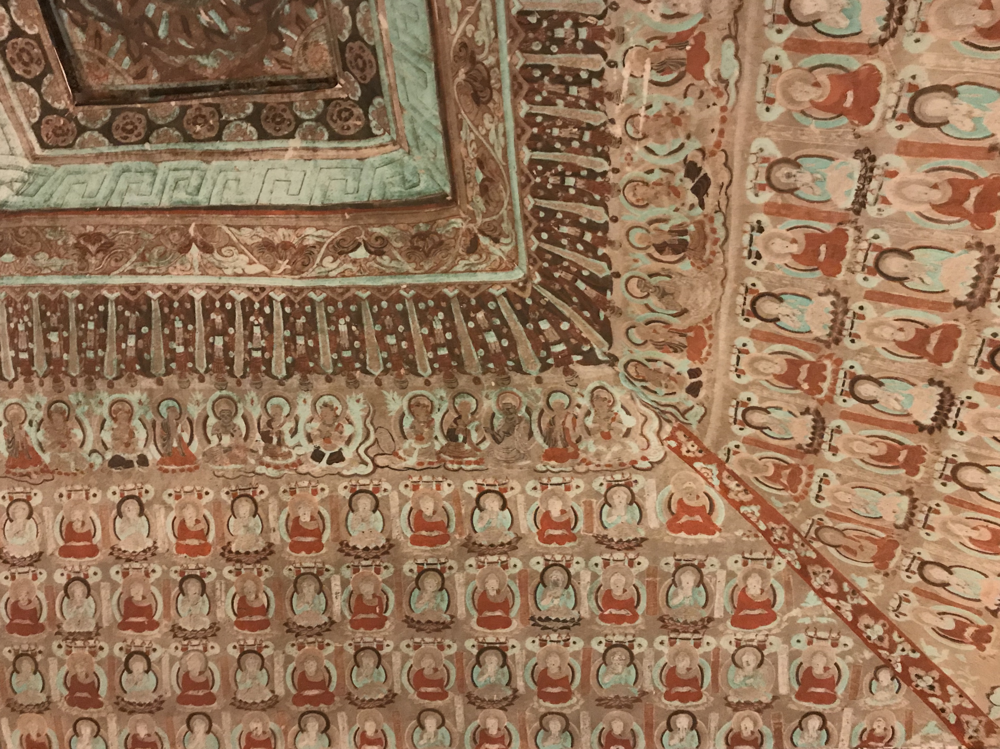
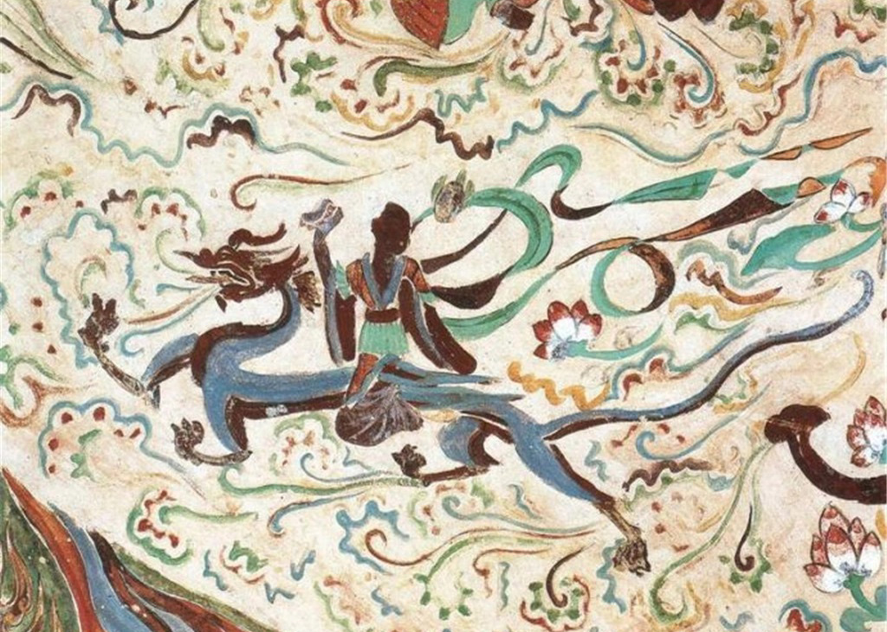

# Mogao Caves · 莫高窟

| | |
|--|--|
|  |  |

## Overview

The Mogao Caves are one of the great artistic monuments of human civilization. Cut into a cliff face 25 kilometres southeast of Dunhuang over a period of roughly a thousand years — from the 4th century to the 14th century AD — 735 caves contain the world's largest surviving collection of Buddhist art: approximately 45,000 square metres of painted murals, 2,400 painted clay sculptures, and a library of manuscripts that, when rediscovered in 1900, comprised the oldest printed book in existence (the Diamond Sutra, dated 868 AD) and tens of thousands of documents in Chinese, Tibetan, Sanskrit, Sogdian, and other Silk Road languages.

The caves were commissioned by a long succession of patrons: Silk Road merchants who funded a cave as an act of piety before a dangerous desert crossing, imperial officials, monks, local rulers, and ordinary devotees over ten dynasties. Each donor commissioned an entire cave program — architecture, sculpture, and all four walls plus ceiling painted in a coherent iconographic scheme. The quality of patronage drove quality of execution, and the result is that cave after cave contains masterworks of a particular era: Northern Wei caves with their elongated, spiritually abstracted figures; Tang Dynasty caves with full, confident human forms in complex narrative scenes; Five Dynasties caves showing the beginning of a more decorative, schematic style.

The caves were effectively forgotten after the Silk Road trade routes were abandoned in the 15th century, and the cliff face was slowly being buried by drifting sand when a Taoist monk named Wang Yuanlu began clearing them in the 1890s. In 1900 he broke through a wall in Cave 17 to discover the sealed Library Cave (藏经洞) — a chamber stacked floor to ceiling with manuscript bundles, undisturbed for nearly 900 years. Much of this collection was subsequently acquired by foreign explorers including Aurel Stein and Paul Pelliot, and is now distributed across the British Library, the Bibliothèque nationale de France, and other institutions. The question of repatriation remains active.

## What to See & Do

- The standard ticket includes 8 caves selected on the day based on conditions and visitor numbers — the selection rotates, so there is no guarantee of specific caves, but all selections are significant
- Cave 96: the 9-storey wooden facade containing the 34.5-metre seated Maitreya Buddha — the largest statue at Mogao
- Cave 17 (if available): the famous Library Cave, now empty, but the exact room where thousands of manuscripts were sealed for 900 years
- Cave 285: one of the best-preserved Northern Wei caves, with a ceiling depicting the vault of heaven
- Cave 45: a Tang Dynasty cave with an extraordinarily lifelike group of painted clay sculptures
- Watch the introductory film in the digital exhibition centre before entering the site — it provides context that makes the caves legible

## Best Time to Visit

The caves are open year-round but July is the busiest month. Morning slots (starting 8:00am) have better light conditions in some caves and slightly smaller crowds than afternoon slots.

## Practical Tips

- **Tickets:** Standard ticket ~¥238/person; must be purchased in advance at mgk.com.cn — peak season tickets (especially July) sell out weeks ahead. **Book this immediately.**
- **Special caves:** A selection of higher-tier "special caves" can be booked for an additional fee (¥200–300/person per cave); these include Cave 285 and Cave 45 among others; also book in advance
- **Opening hours:** 8:00am–5:00pm (last entry earlier); the digital exhibition centre opens before site access
- **Photography:** Strictly prohibited inside the caves — no exceptions, including phone cameras. This is enforced by guides.
- **Tours:** Access is only via guided group tour in groups of ~25; English guides available but must be requested at time of booking; Chinese-speaking guides are the default
- **Duration:** Standard visit ~2.5 hours including film and 8 caves; allow 3 hours total
- **Getting there:** 25km southeast of Dunhuang city centre, approximately 30 minutes by taxi or shuttle bus

## Why It's Worth It

To stand inside a cave that a Tang Dynasty merchant paid to decorate in 720 AD, surrounded by paintings that have not moved in 1,300 years, looking at Buddhist figures rendered with the full technical mastery of the greatest empire of the medieval world — there is no comparable experience in China, and very few comparable experiences anywhere on earth.

## Videos

- [Mogao Caves (UNESCO/NHK)](https://www.youtube.com/watch?v=hK4PxrQH8ok) — UNESCO and NHK co-produced documentary on the caves and their history
- [What are the Mogao Caves and why are they special?](https://www.youtube.com/watch?v=-LbyuIi9BYI) — accessible introduction to the site's significance
- [Exploring the Mogao Caves: Journey into the Ancient Splendor | China Travel Guide](https://www.youtube.com/watch?v=zInyehUgriE) — English-language visitor's guide and walkthrough
- [Cave Temples of Dunhuang: Buddhist Art on China's Silk Road](https://www.youtube.com/watch?v=J2ODpmJS_Dg) — Getty Research Institute lecture on the art and manuscripts
