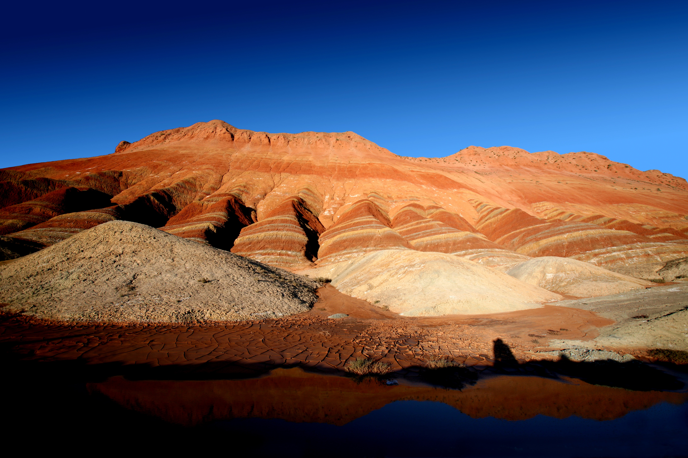

# Zhangye Qicai Danxia · 张掖七彩丹霞

📍

Open in Maps

<a href="https://maps.apple.com/?ll=38.937,100.467&q=Qicai+Danxia" target="_blank" style="display:block; padding:5px 0; text-decoration:none; font-size:13px; color:#333;">🍎 Apple Maps</a>
<a href="https://www.google.com/maps?q=38.937,100.467" target="_blank" style="display:block; padding:5px 0; text-decoration:none; font-size:13px; color:#333;">🌐 Google Maps</a>
<a href="https://uri.amap.com/marker?position=100.467,38.937&name=七彩丹霞" target="_blank" style="display:block; padding:5px 0; text-decoration:none; font-size:13px; color:#333;">🗺 高德地图 (Amap)</a>
<a href="https://api.map.baidu.com/marker?location=38.937,100.467&title=七彩丹霞&output=html" target="_blank" style="display:block; padding:5px 0; text-decoration:none; font-size:13px; color:#333;">🔵 百度地图 (Baidu)</a>

| | |
|--|--|
|  |  |

## Videos

<iframe width="100%" height="200" src="https://www.youtube-nocookie.com/embed/TC-nvgFi5HU" title="Unbelievable Rainbow Mountains of Zhangye Danxia | Amazing Places in China" frameborder="0" allow="accelerometer; autoplay; clipboard-write; encrypted-media; gyroscope; picture-in-picture" allowfullscreen style="border-radius:8px;"></iframe>

aerial and ground-level footage of the colored formations

## Overview

"Qicai" means "seven-colored" and "Danxia" refers to the geological formation — a specific type of red sandstone and conglomerate landscape found in certain parts of China that erodes into dramatic cliffs, towers, and ravines. Zhangye's Qicai Danxia takes the Danxia form to its most extreme chromatic expression: the rock strata here were laid down as sediment in an inland sea over 24 million years, each layer recording a different mineral environment — iron oxides producing reds and oranges, chlorite producing greens, manganese producing purples and blues, silica producing yellows and whites. Time, uplift, and erosion then cut through the stack to expose the cross-section, resulting in a hillscape banded in stripes of color that run the full spectrum.

The site covers about 50 square kilometres of ridges and valleys in Linze County, Zhangye, at around 1,800 metres altitude in the Hexi Corridor. The formations extend to the horizon in every direction from the viewing platforms, giving the landscape a planetary, almost geological scale. In early morning or late afternoon, the oblique light catches the iron-red and orange layers and the colors seem internally lit — deep amber and rust contrasting with the greens and purples below. At midday the light is harsher and the palette flatter; the timing of a visit significantly affects the experience.

This landscape was almost unknown outside China until around 2010, when photographs began circulating online and rapidly became iconic — one of the most-shared images of the Chinese interior. It has since become a major destination, but the sheer scale of the formations means the crowds are absorbed without the sense of compression you get at, say, the Mogao Caves. You are on raised boardwalks looking out over ridges that go all the way to the horizon, and the landscape remains overwhelming regardless of how many people are on the platform beside you.

## What to See & Do

- Take the park shuttle buses between the four main viewing platforms (台) — each offers a different angle and different color emphasis
- Platform 4 (四号观景台) is considered the most photogenic for the full panorama of layered color
- Arrive as early as possible (park opens at 7:00am in summer) for the best morning light on the red formations
- Alternatively, the last shuttle of the day (around 5:30pm) catches the late afternoon golden hour
- Photograph both the wide vista and the close-up texture of individual banded rock faces — the two scales give completely different impressions
- Look for the areas where green and purple layers abut orange-red ones — these color transitions are the most visually striking

## Best Time to Visit

June through October. July mornings (7:00–9:00am) are ideal for light and temperature. Rain can briefly intensify the colors by darkening the rock surfaces, so overcast mornings before rain are occasionally more dramatic than clear-sky middays.

## Practical Tips

- **Tickets:** ~¥75/person, includes shuttle buses within the park
- **Opening hours:** 7:00am–7:00pm in summer; shuttles run approximately every 20 minutes
- **Duration:** 2–2.5 hours for a full circuit of all four main platforms
- **Getting there:** ~40km northwest of Zhangye city centre, approximately 40 minutes by car; the park is clearly signposted from the city
- **Facilities:** Visitor centre with toilets, food, and souvenirs at the main entrance; toilets at each viewing platform

## Why It's Worth It

The images look like digital color grading. Arriving in person and understanding that these are real geological strata, each stripe a chapter of 24 million years of planetary history, is the kind of encounter with Earth's deep time that is rare and not easily forgotten.

<iframe width="100%" height="200" src="https://www.youtube-nocookie.com/embed/1bft6NWuVbk" title="RAINBOW MOUNTAINS of CHINA: Why You Need To Visit Zhangye" frameborder="0" allow="accelerometer; autoplay; clipboard-write; encrypted-media; gyroscope; picture-in-picture" allowfullscreen style="border-radius:8px;"></iframe>

English travel vlog with practical visitor information and photography tips

