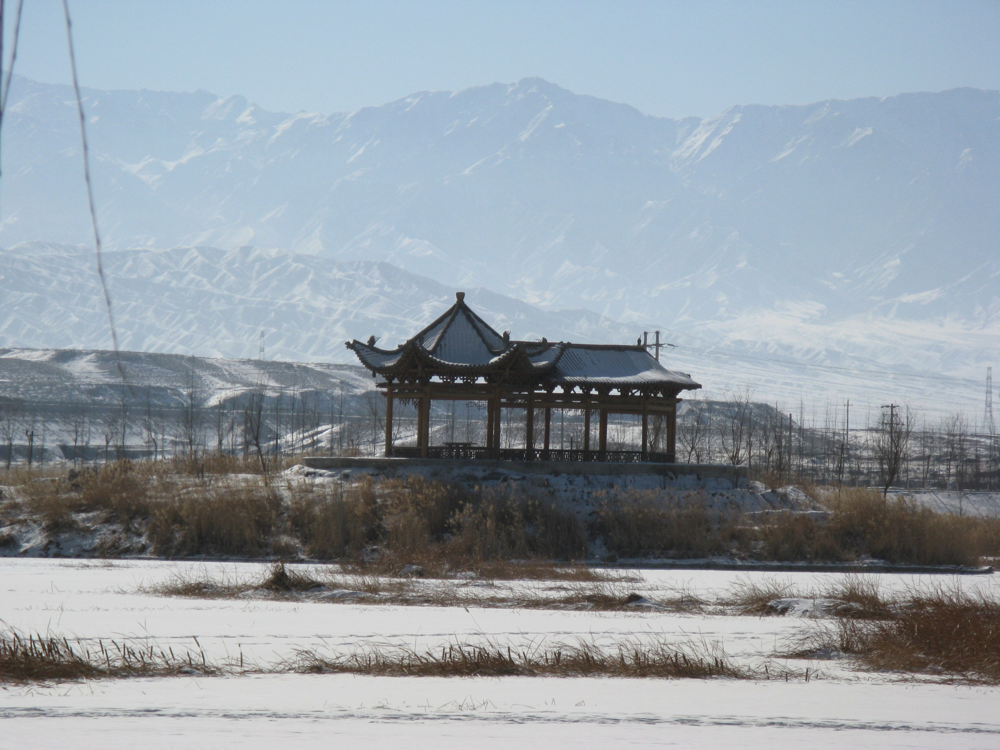
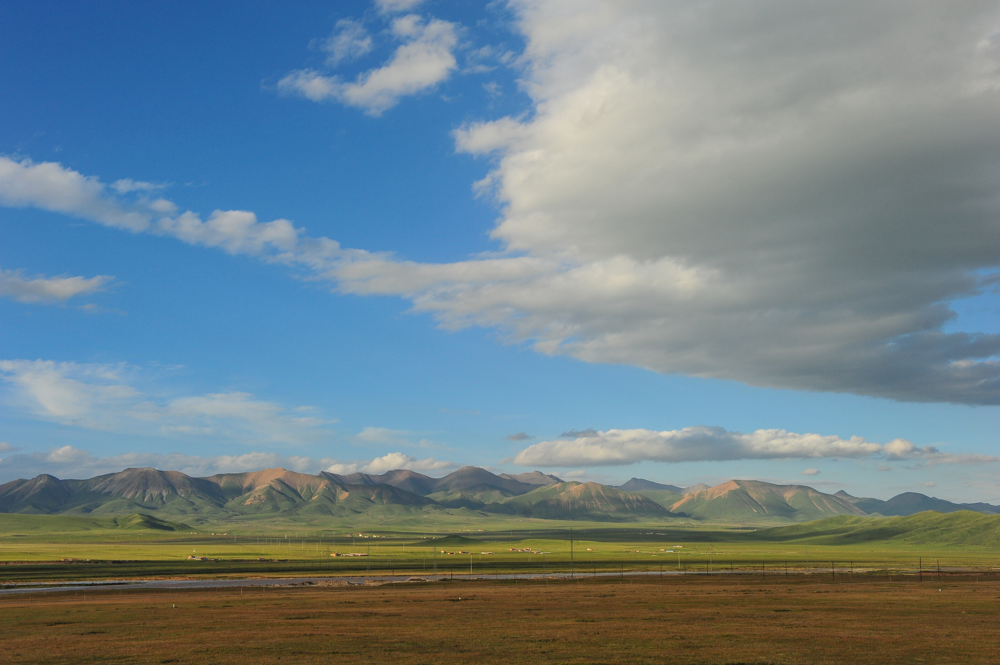

# Qilian Grassland · 祁连草原

📍

Open in Maps

<a href="https://maps.apple.com/?ll=38.183,100.25&q=Qilian+Grassland" target="_blank" style="display:block; padding:5px 0; text-decoration:none; font-size:13px; color:#333;">🍎 Apple Maps</a>
<a href="https://www.google.com/maps?q=38.183,100.25" target="_blank" style="display:block; padding:5px 0; text-decoration:none; font-size:13px; color:#333;">🌐 Google Maps</a>
<a href="https://uri.amap.com/marker?position=100.25,38.183&name=祁连草原" target="_blank" style="display:block; padding:5px 0; text-decoration:none; font-size:13px; color:#333;">🗺 高德地图 (Amap)</a>
<a href="https://api.map.baidu.com/marker?location=38.183,100.25&title=祁连草原&output=html" target="_blank" style="display:block; padding:5px 0; text-decoration:none; font-size:13px; color:#333;">🔵 百度地图 (Baidu)</a>

| | |
|--|--|
|  |  |

## Overview

Qilian County (祁连县) sits at 2,787 metres at the confluence of the Babao River valley and the Qilian Mountains — a county of roughly 50,000 people, predominantly Tibetan and Yugur, whose economy runs on herding, tourism, and small-scale mining. The grassland that surrounds and runs above the county town is among the most accessible and visually dramatic high-altitude pastoral landscapes in northwest China: rolling hills of alpine meadow grass interspersed with wildflowers, traversed by clear mountain streams, backed by the Qilian ridgeline that in July is still white-capped with winter snow.

The Yugur people (裕固族) are particularly notable here — a small Turkic-speaking ethnic group of approximately 14,000 people, found almost exclusively in this area, who maintain herding traditions and a distinctive material culture. Tibetan communities have been present in the Qilian range for over a millennium and the area's mountain passes are studded with Tibetan Buddhist cairns (ovoos) and prayer flags. The co-existence of these two distinct pastoral cultures — Yugur and Tibetan — with Han Chinese settlers in the valley towns gives Qilian County an ethnic and cultural texture that is unusual even in the diverse northwest.

The visual impact of arriving in Qilian after the preceding five days of the route is significant. The journey has traversed salt lakes, barren basins, scorching desert, and painted rock formations — all beautiful, all fundamentally arid. Qilian presents the opposite: green, wet, cool, alive. In late July the meadows are at peak color, with purple and yellow wildflowers in dense patches among the grass. Yaks graze on every hillside. The air smells of grass and river water. The temperature is 15–20°C. After the Dunhuang desert, it feels like a different planet — which in many ways it is.

## What to See & Do

- Horseback riding on the grassland: arrange through the hotel the night before (~¥120/person/hour); local Tibetan and Yugur guides lead rides across the rolling meadows above the valley
- Walk the riverbank path along the Babao River at dusk — the light on the mountains is exceptional at 7:00–8:00pm in July
- Drive or hike up the Babao Valley toward the mountain passes for higher-altitude meadow landscapes
- Look for yaks: they are everywhere on the hillsides and the young calves are particularly photogenic in July
- Visit a local herder family if your Chinese-speaking companions can arrange it — genuinely hospitable, selling fermented yak milk (酸奶) and other dairy products
- Look for the distinctive Yugur embroidery patterns on clothing and tent furnishings at local markets

## Best Time to Visit

Late June through early August is peak season for the grassland. July is ideal: all the wildflowers are in bloom, the grass is at maximum green, and the mountain snow is still present on the higher peaks for visual contrast. By September the grass begins to yellow and the nights drop below 5°C.

## Practical Tips

- **Horseback riding:** ~¥120/person/hour; arrange the night before through hotel reception; confirm the number of horses for all 7 group members; rides typically depart 8:00–8:30am
- **Clothing:** July mornings at 2,800m are cold — bring a light down jacket or warm layer for the morning ride; afternoons warm to 18–22°C
- **Getting there:** Qilian County town is the endpoint of Day 6 (~230km from Zhangye via Menyuan, ~3 hours); the grassland begins immediately at the edge of town
- **Overnight:** Qilian has adequate hotels and guesthouses in the mid-range; book ahead in July as it is a popular weekend destination for Xining residents
- **Food:** Excellent lamb hotpot (涮羊肉) at local restaurants; Qilian lamb is considered some of the best in Qinghai

## Why It's Worth It

After five days of salt, sand, and painted stone, arriving at a high-altitude green valley in the Qilian Mountains — cool air, wildflowers, snow peaks, yaks on every hill — is the best possible final note to a route built on landscape contrasts. The morning horseback ride is an hour that most first-time visitors to China would never find on their own.

## Videos

- [Qilian Mountains: nature's high-altitude treasure trove in NW China](https://www.youtube.com/watch?v=2z805pWp93A) — CGTN documentary on the ecology and landscape of the Qilian range
- [Driving Through China's Most Breathtaking Mountain Road | Qilian Mountains & Eboling Pass 4K](https://www.youtube.com/watch?v=MkzpAdWWzxQ) — 4K driving footage through the Qilian mountain passes
- [3000m High Cliff Road in Qilian Mountains, China: The Only Route for Tibetan Herders 4K](https://www.youtube.com/watch?v=wjtUPvldRLc) — dramatic cliff road footage showing the high-altitude pastoral landscape
