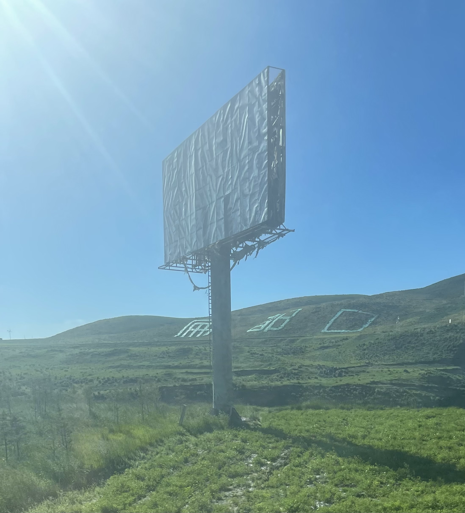
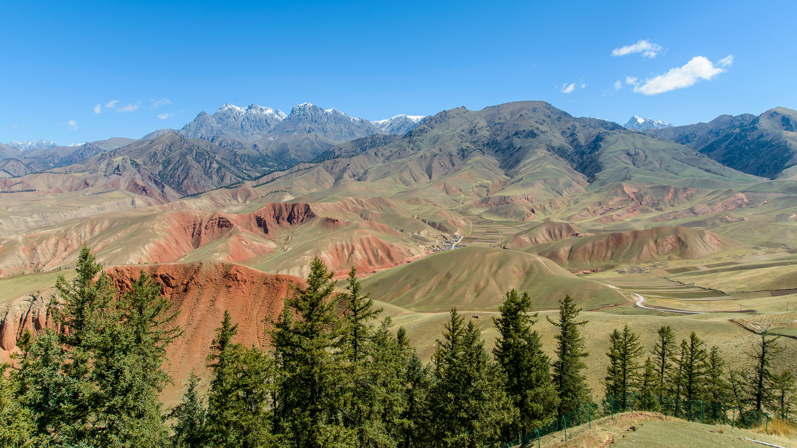
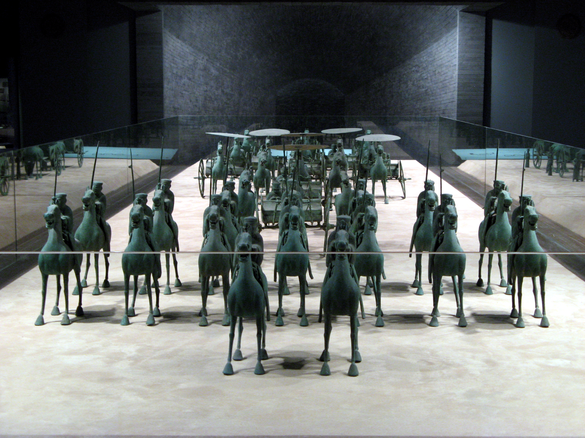

# Shandan Military Horse Farm · 山丹军马场

📍

Open in Maps

<a href="https://maps.apple.com/?ll=38.733,101.0&q=Shandan+Horse+Farm" target="_blank" style="display:block; padding:5px 0; text-decoration:none; font-size:13px; color:#333;">🍎 Apple Maps</a>
<a href="https://www.google.com/maps?q=38.733,101.0" target="_blank" style="display:block; padding:5px 0; text-decoration:none; font-size:13px; color:#333;">🌐 Google Maps</a>
<a href="https://uri.amap.com/marker?position=101.0,38.733&name=山丹军马场" target="_blank" style="display:block; padding:5px 0; text-decoration:none; font-size:13px; color:#333;">🗺 高德地图 (Amap)</a>
<a href="https://api.map.baidu.com/marker?location=38.733,101.0&title=山丹军马场&output=html" target="_blank" style="display:block; padding:5px 0; text-decoration:none; font-size:13px; color:#333;">🔵 百度地图 (Baidu)</a>

| | |
|--|--|
|  |  |

## Videos

- [Shandan Horse Farm: A jewel of the Silk Road and Qilian Mountains — China Daily](http://gansu.chinadaily.com.cn/2024-05/20/c_988621.htm) — video and photo feature on the farm's history, summer landscape, and horse herds (China Daily 2024)

## Overview

The Shandan Military Horse Farm (山丹军马场) is, depending on who you ask, either the largest military horse farm in the world or the largest in Asia — either way, it is enormous. Covering over 2,000 square kilometres of alpine grassland at the northern foot of the Lenglong Ridge of the Qilian Mountains, Shandan straddles the border of Gansu and Qinghai provinces and sits squarely on the route between Zhangye and Menyuan — which makes it a natural stop on the Day 6 drive.

The farm's history is one of the longest continuous institutional histories in China. It was established in 121 BC by General Huo Qubing of the Western Han Dynasty, following his decisive military campaigns against the Xiongnu nomads in this region. The Han Dynasty needed a steady supply of horses for its cavalry and found in the Damaying Grasslands at the foot of the Qilian Mountains an ideal location: abundant water from mountain snowmelt, rich alpine grass, and a climate that produced hardy, strong horses. The farm has operated continuously — or near-continuously — through Han, Wei, Jin, Sui, Tang, Song, Yuan, Ming, Qing, Republic, and People's Republic eras, adapting its role from imperial cavalry supplier to agricultural cooperative to its current form as an active People's Liberation Army horse breeding facility that also receives visitors in its outer zones.

The horses here are primarily a Shandan breed — a cross between Mongolian horses and various European bloodlines introduced over the centuries — and they roam freely across the enormous grasslands in herds of dozens or hundreds. In summer, tens of thousands of horses are visible across the valley floor. The Qilian mountain peaks form the backdrop to the south. The scene — vast green grassland, vast blue sky, scattered herds of horses — is one of those moments where China offers something that looks more like Wyoming or Patagonia than the China of most people's imagination. The military presence means the inner farm zones are restricted, but the outer roads and approach areas give excellent views of the horses at close range, and the drive itself through the grasslands is memorable.

## What to See & Do

- **Drive-through horse viewing** — the outer access roads pass directly alongside grassland where horses graze freely; you can pull over anywhere on these roads and watch or photograph horses at close range without entering any restricted zone
- **Damaying Grassland** — the main valley floor of the farm area, with unobstructed views of the Qilian peaks to the south and horse herds across the foreground
- **First Ranch (一场)** — the closest accessible section of the farm to the main road; altitude approximately 2,800m; views of snow peaks and working horse operations
- **Rapeseed fields (July)** — in peak July, the grasslands are interspersed with rapeseed flower fields; the combination of yellow flowers, green grass, snow mountains, and horse herds is a remarkable visual
- **Horseback riding (paid activity)** — the outer visitor zone has commercial horseback riding for visitors at approximately ¥50/person/hour; worth doing if you skipped the Qilian grassland riding on Day 7

## Best Time to Visit

June to September. **July is optimal**: the grass is fully green, the rapeseed may be in bloom, the snowpeaks are visible, and the weather is mild. The temperature at the farm (2,800m+) is noticeably cooler than the valley towns — bring a light layer even in July.

## Practical Tips

- **Location:** On the G227 road between Zhangye and Menyuan, approximately 55km south of Shandan County town. On the Day 6 route, the farm road branches off the G227 south of Shandan County — it is a short detour from the main road or a natural drive-through depending on which routing you take.
- **Access:** Self-driving is ideal; navigate to "山丹军马场" or "Shandan Military Horse Farm." The outer grassland roads are open to regular vehicles. The inner military zones are off-limits and clearly marked.
- **Entry fee:** No fixed entry fee for the public outer area; if you enter the formal visitor zone near First Ranch, there may be a nominal fee (¥20–30); confirm locally
- **Duration:** 45 minutes as a roadside stop to pull over, photograph horses, and continue; 2–3 hours if you want to ride, walk the grasslands, or drive deeper into the valley
- **Itinerary fit for Day 6:** Depart Jiayuguan 8am → Danxia 10:30am–1pm → Zhangye lunch 1:30pm → Giant Buddha Temple 2:30pm → Shandan Horse Farm approx 4:30–5:15pm (45min) → Menyuan flowers stop → arrive Qilian 7–7:30pm. This is an ambitious Day 6 but all sections are manageable with tight transitions.
- **Altitude:** The farm is at 2,800–3,500m depending on the zone; if any member of the group is sensitive to altitude, a 45-minute stop is fine — no strenuous activity required.
- **Military context:** The farm is an active PLA facility. Visitors are restricted to the outer zones. Photography is generally fine in the public areas but do not photograph military facilities, personnel, or infrastructure.

## Why It's Worth It

Two thousand years of unbroken horse breeding history, tens of thousands of horses roaming a valley that looks like the edge of the world — and it is directly on the road you are already driving.
