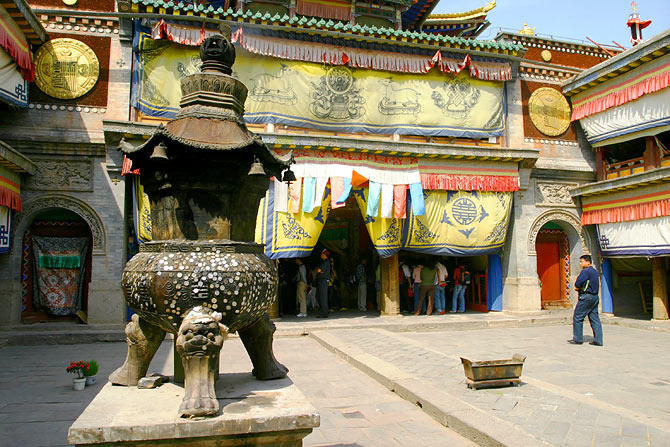
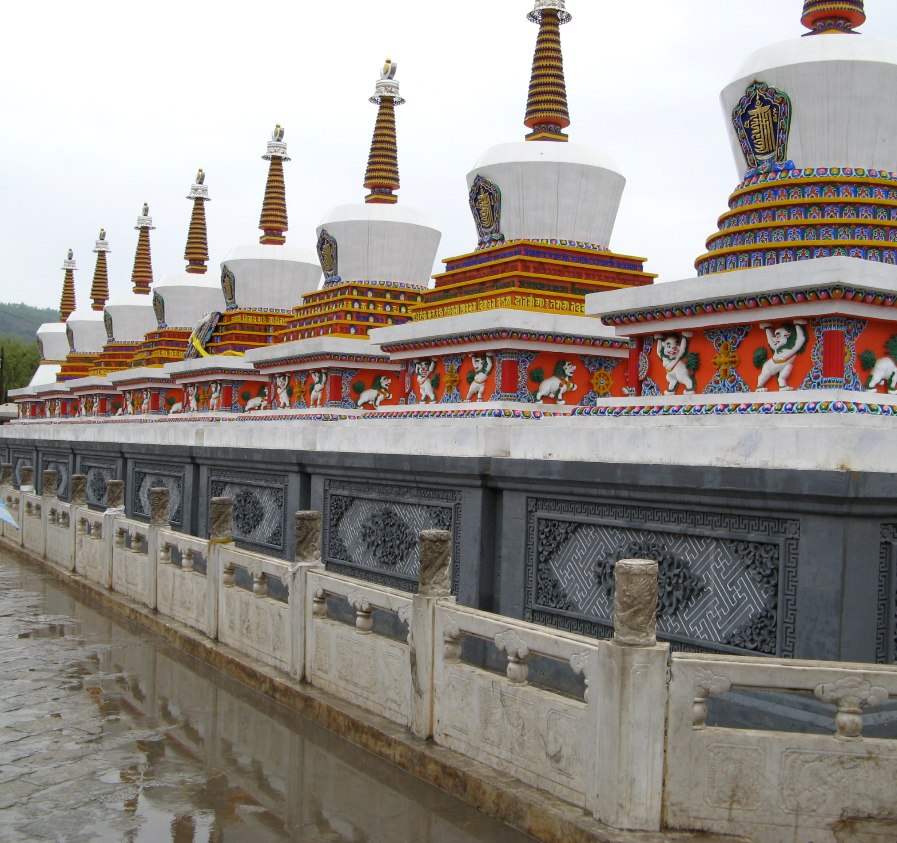
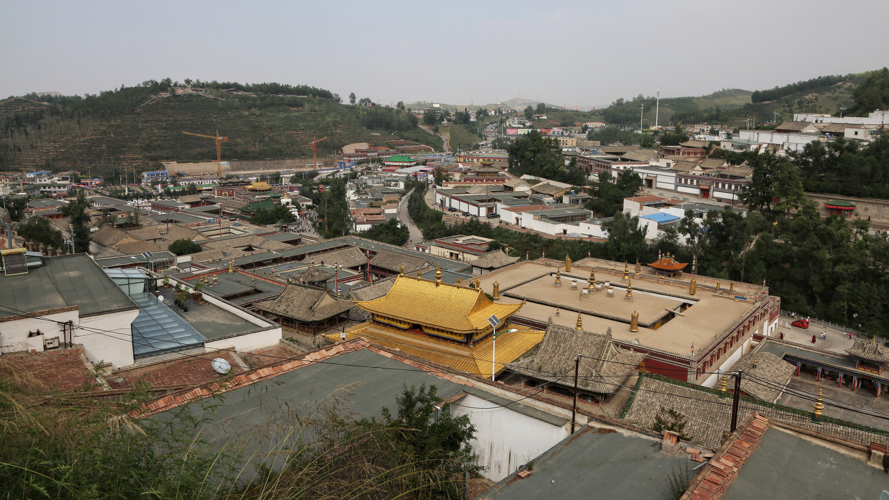

# Ta'er Monastery · 塔尔寺

📍

Open in Maps

<a href="https://maps.apple.com/?ll=36.486,101.569&q=Ta'er+Monastery" target="_blank" style="display:block; padding:5px 0; text-decoration:none; font-size:13px; color:#333;">🍎 Apple Maps</a>
<a href="https://www.google.com/maps?q=36.486,101.569" target="_blank" style="display:block; padding:5px 0; text-decoration:none; font-size:13px; color:#333;">🌐 Google Maps</a>
<a href="https://uri.amap.com/marker?position=101.569,36.486&name=塔尔寺" target="_blank" style="display:block; padding:5px 0; text-decoration:none; font-size:13px; color:#333;">🗺 高德地图 (Amap)</a>
<a href="https://api.map.baidu.com/marker?location=36.486,101.569&title=塔尔寺&output=html" target="_blank" style="display:block; padding:5px 0; text-decoration:none; font-size:13px; color:#333;">🔵 百度地图 (Baidu)</a>

 <a href="https://www.google.com/search?q=Ta%27er%20Monastery%20%C2%B7%20%E5%A1%94%E5%B0%94%E5%AF%BA%20China%20travel&tbm=isch" target="_blank" style="text-decoration:none; font-size:1.2rem;" title="Search images">🖼</a>

| | |
|--|--|
|  |  |

## Videos

- [Kumbum Monastery — Elevated Trips](https://www.elevatedtrips.com/locations/kumbum-monastery/) — detailed photo and video documentary of the monastery's architecture and atmosphere (travel website with embedded video)

## Overview

Ta'er Monastery — known in Tibetan as Kumbum, meaning "the place of one hundred thousand images of Buddha" — is one of the six great monasteries of the Gelug school of Tibetan Buddhism and one of the most important religious sites in all of China. Located 26 kilometres southwest of Xining in Huangzhong County, the monastery was founded in 1583 on the birthplace of Tsongkhapa, the 14th-century scholar-monk who reformed Tibetan Buddhism and established the Gelug school — the tradition of the Dalai Lamas. A silver stupa marks the exact spot where Tsongkhapa was born; his mother reportedly planted a sandalwood tree there, and according to tradition, 100,000 images of the Buddha miraculously appeared on the tree's leaves — the origin of the monastery's Tibetan name.

The monastery complex today contains over 9,300 rooms spread across 52 halls and temples, including scripture halls, debate courtyards, pagodas, and residences for the more than 800 monks in active residence. The architecture blends Han Chinese and Tibetan styles in an unusually seamless way — glazed tile roofs sit alongside gold-topped stupas, and the exterior walls of the main halls are decorated with sculpted deer and dharma wheels typical of Tibetan monasteries. Visiting on a weekday morning, you are likely to encounter monks studying, debating, walking between halls in robes, and performing rituals — this is an actively functioning religious institution, not merely a tourist site.

For first-time visitors to China who have not previously encountered Tibetan Buddhism, Ta'er Monastery provides a remarkable introduction. The scale is genuinely grand; the incense smoke, the sound of chanting, and the sheer visual density of the place — butter lamps, thangka paintings, enormous gilded Buddha statues — creates an immersive sensory experience unlike anything in the Han Chinese Buddhist temples most visitors encounter in eastern China. It is also an important reminder that Qinghai Province is culturally Tibetan at its core, despite being administratively Chinese — something the rest of the road trip's landscape confirms but doesn't frame as explicitly as this monastery does.

## What to See & Do

- **Great Golden Roof Hall (大金瓦殿)** — the monastery's most famous hall, with a gilded roof visible from a distance; houses the stupa marking Tsongkhapa's birthplace; the spiritual heart of the complex
- **Butter sculpture art (酥油花)** — Ta'er Monastery's most famous cultural creation: intricate sculptures made entirely from coloured yak butter, depicting Buddhist narratives, flowers, and figures. Produced by monks each year for the Lantern Festival. Best examples are displayed in the Butter Sculpture Exhibition Hall.
- **Mural art and embroidered thangkas** — along with butter sculptures, the monastery's "Three Artistic Uniques" include extraordinary mural paintings and three-dimensional embroidered thangkas; the artistry is genuinely exceptional
- **Eight White Stupas (八宝如意塔)** — a row of white stupas at the main entrance, built in 1776 to commemorate eight key events in the Buddha's life; a classic photograph location
- **Scripture Debate Courtyard** — monks debate Buddhist philosophy in formal sessions; check the posted schedule and ask at the entrance if a debate session is happening during your visit
- **Surrounding village and market** — the Tibetan village of Lusar around the monastery has a lively market with butter tea, yak products, and religious objects; interesting for 30 minutes of wandering

## Best Time to Visit

Open year-round, 7:00am–18:00pm (high season) or 8:00am–17:00pm (low season). July visits are in high season. Early morning (before 9am) is significantly less crowded than mid-morning. The **Butter Lamp Festival** (Lantern Festival, 15th day of the first lunar month) is the most spectacular time to visit, when the butter sculptures are displayed at night, but it falls in February/March — not relevant to a July trip.

## Practical Tips

- **Distance:** 26km from central Xining; 40 minutes by car, or take Bus 909 from Xining train station (¥4, 1 hour, departs every 6 minutes from 6:30am)
- **Entry fee:** ~¥70 per person (high season); some individual halls charge an additional ¥10–15 each
- **Duration:** 1.5–2.5 hours depending on interest level; a focused visit to the main halls takes 90 minutes, a thorough visit with the market is 2.5 hours
- **Photography:** Photography is **prohibited inside the halls** — strictly enforced. The exterior courtyards, stupas, and open areas are fine to photograph.
- **Itinerary fit for this trip:** This is a pre-trip activity for Xining. Options: (a) Visit on the morning of July 18 (Day 0) before the 1pm car pickup — leave Xining by 7am, visit until 10am, return to central Xining by 11am with time to collect luggage and meet the car; (b) Arrive in Xining one day earlier (July 17) and treat it as a standalone half-day outing; (c) Add to the Day 7 return — arriving back in Xining around 12:30pm on July 24, there is time for a 2-hour visit before an evening departure
- **What to wear:** As in any active religious site, modest dress is expected; shoulders and knees should be covered. No shorts.

## Why It's Worth It

Ta'er Monastery is the one place on or near this route where the landscape gives way to something entirely human — a thousand years of Buddhist art and living monastic tradition packed into a single extraordinary hillside complex.
