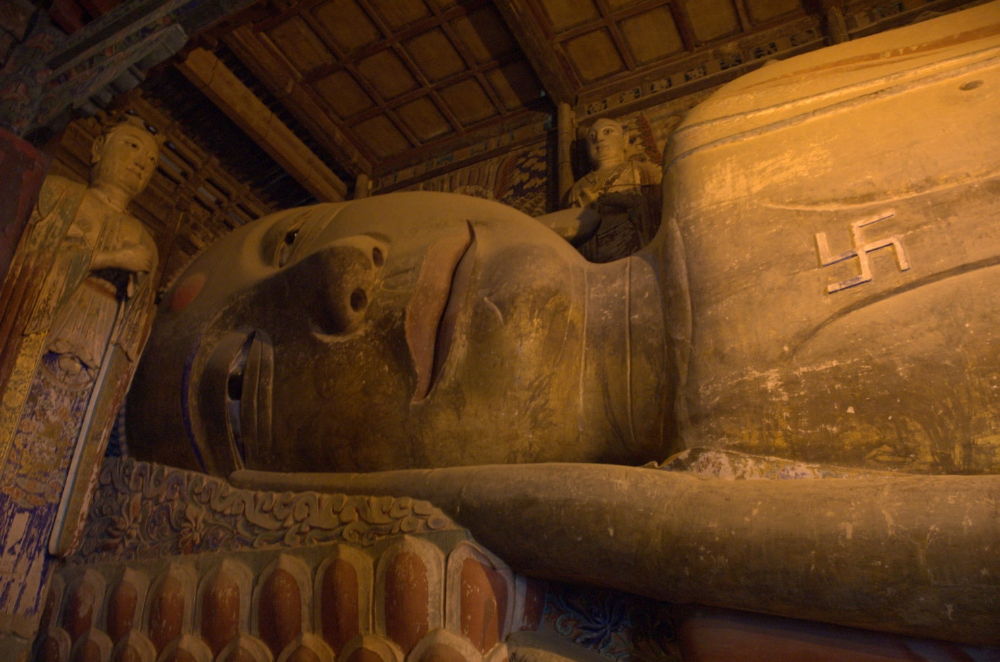
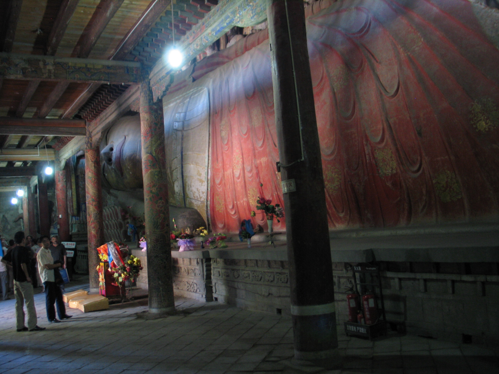
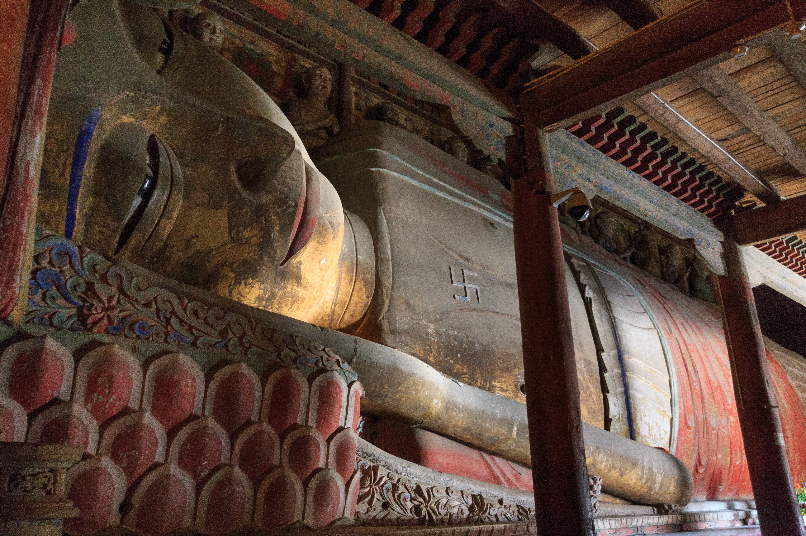

# Giant Buddha Temple · 张掖大佛寺

| | |
|--|--|
|  |  |

## Overview

The Giant Buddha Temple (大佛寺, Dàfó Sì — "Great Buddha Temple") in the centre of Zhangye city houses China's largest indoor reclining Buddha: a 34.5-metre clay-on-timber statue of the historical Buddha Shakyamuni at the moment of parinirvana, entering final nirvana. Built in 1098 during the Western Xia dynasty, the statue is almost certainly the oldest surviving major Buddhist monument in the Gansu corridor. The ten disciples of the Buddha stand arranged behind the reclining figure in the same hall; the scale of the composition is genuinely staggering — up to eight people can stand on the ear of the main figure. The entire complex was designated a major national cultural heritage site in 1996.

The Western Xia (西夏, 1038–1227) were a Tangut people who built an empire controlling the eastern Silk Road during the same period when the Song dynasty ruled southern China. They were enthusiastic patrons of Tibetan Buddhism, and the Giant Buddha Temple is among their most important surviving architectural commissions. The temple was spared destruction when Genghis Khan besieged and eventually destroyed the Western Xia capital in 1227 — partly because, according to some accounts, the Mongols were impressed by what they found there. Marco Polo passed through Zhangye in the 1270s during his journey along the Silk Road to Kublai Khan's court, and his description of the city — which he called Campichu — mentions temples containing giant reclining Buddha figures that he found astonishing. This is almost certainly the same statue he saw.

The temple complex covers 23,000 square metres and includes the main Buddha Hall, a scripture hall housing more than 6,000 volumes of Buddhist texts (some written in gold and silver ink), a sutra pagoda, and supporting courtyards. The architecture combines typical Song/Western Xia features with later Ming and Qing repairs, but the core of the main hall and the statue it contains have survived more than nine centuries largely intact. After a major restoration completed in 2006, the temple is now in excellent condition and draws large numbers of both domestic tourists and religious pilgrims.

## What to See & Do

- **Main Buddha Hall (大佛殿)** — the centrepiece: enter from the front and walk the full length of the 34.5-metre reclining figure; the scale can only be understood by standing next to it. The polychrome clay work on the face and the gilded ornamental details on the robes are extraordinary.
- **Ten disciples** — the full-size standing figures of the Buddha's principal disciples arranged behind the reclining statue; each is individually characterised and impressive in its own right
- **Gold and silver sutras** — the scripture hall displays some of the temple's most precious holdings; the hand-copied texts written in gold ink on dark paper are visually stunning
- **Sutra pagoda (土塔)** — the earthen pagoda in the rear of the complex is one of the oldest structures on the site; walk to the top for a view over the rooftops
- **Museum collection** — the temple has a well-organised exhibition hall with Buddhist artefacts, Western Xia dynasty relics, and historical context for the site's place on the Silk Road

## Best Time to Visit

Open year-round, typically 8:00am–18:00pm. July is fine — there is no outdoor exposure required and the main hall is air-conditioned. Weekday mornings are least crowded. The temple is right in Zhangye city centre so there is no logistical challenge regardless of when you visit.

## Practical Tips

- **Location:** Dafosi Alley, Minzhu West Road, Ganzhou District, Zhangye — in the city centre, walkable from most Zhangye hotels and restaurants
- **Entry fee:** ¥40 per person (as of 2024); free for children under 1.2m and seniors over 70
- **Duration:** 30–45 minutes for a focused visit covering the main hall, sutras, and pagoda; an hour if you want to read the exhibition panels carefully
- **Itinerary fit:** This is a zero-extra-driving addition to the **Day 6 lunch stop in Zhangye**. The plan is to arrive in Zhangye around 1:30pm for lunch. After eating, walk to or take a taxi to the temple (it is in the city centre), spend 30–45 minutes inside, and depart Zhangye by 3pm to continue toward Qilian. Total time cost: approximately 1 hour including transit from a central restaurant.
- **Combined with Qicai Danxia:** The Danxia park is 40km east of Zhangye; the Giant Buddha Temple is in the city centre. The standard Day 6 plan visits Danxia in the morning, then passes through Zhangye for lunch. Adding the temple turns the lunch stop from 1 hour to 2 hours — still comfortable.
- **Marco Polo connection:** If you are interested in the Silk Road history, the temple has signage about Marco Polo's visit and the Western Xia dynasty; this context significantly enriches the visit.

## Why It's Worth It

You are already stopping in Zhangye for lunch — spending 30 minutes standing next to a 900-year-old 34-metre reclining Buddha that Marco Polo may have seen is one of the best free upgrades available anywhere on this trip.

## Videos

- [Zhangye Dafo Temple — China Discovery guide](https://www.chinadiscovery.com/gansu/zhangye/giant-buddha-temple.html) — detailed written guide with embedded photography and visitor information (travel website)
